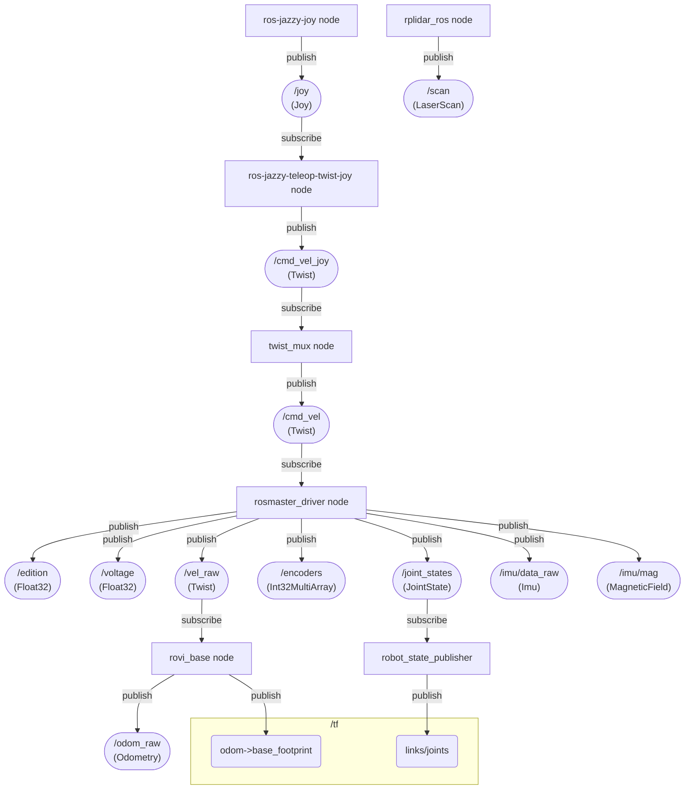
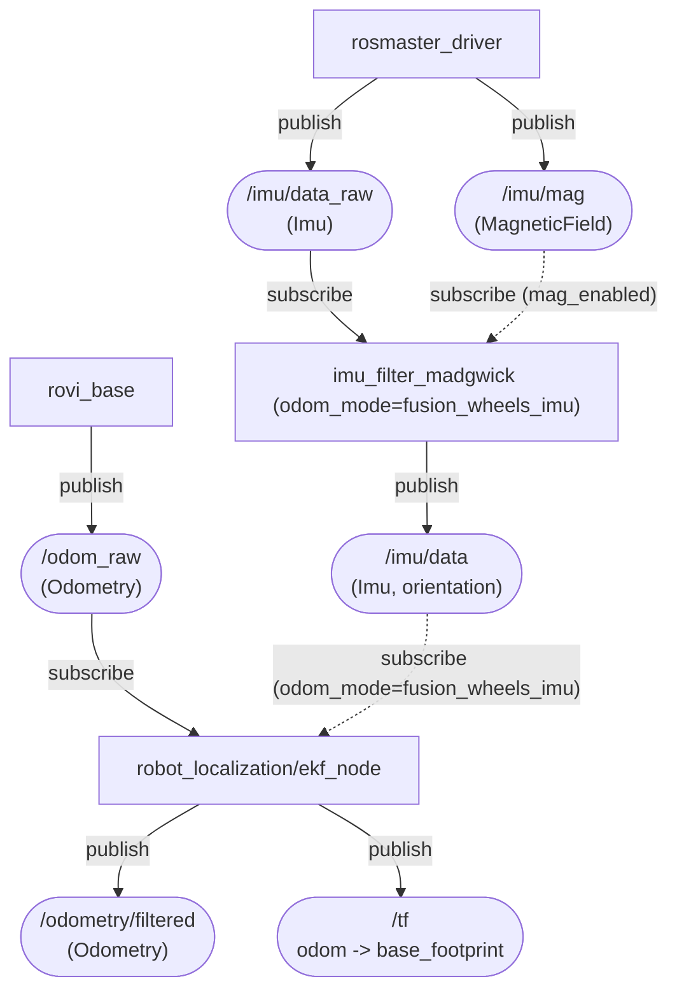
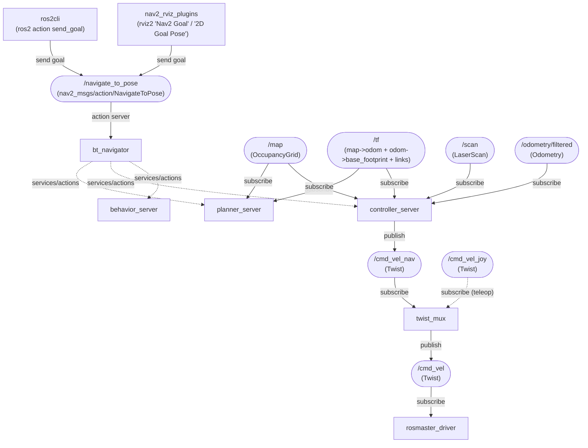
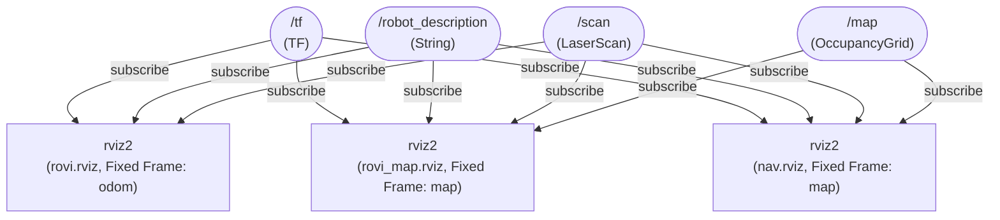
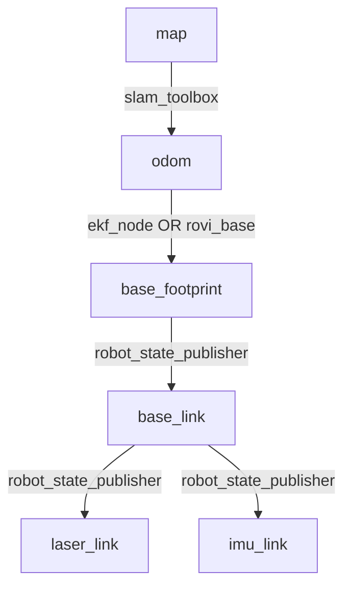
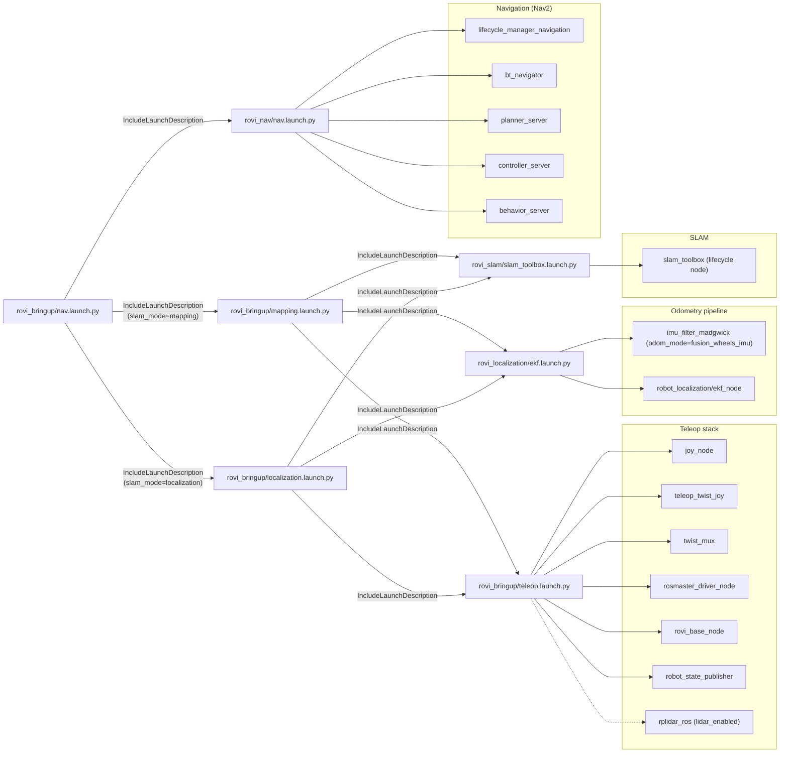
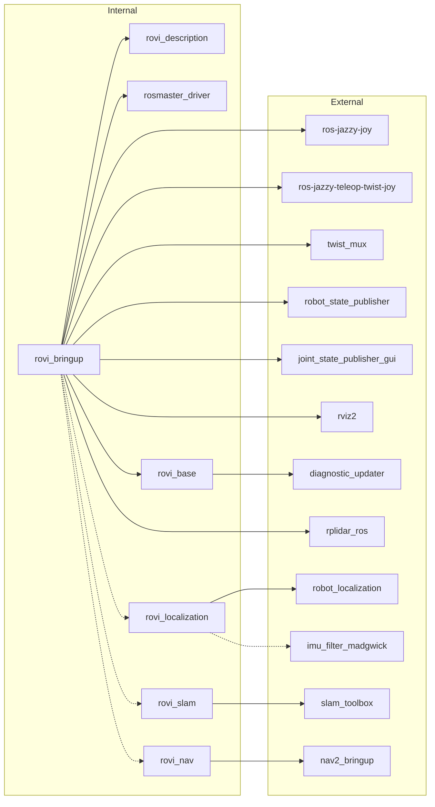
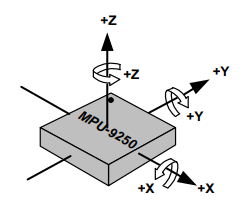

# rovi_ros_ws
ROS2 Jazzy workspace for Room View Bot

# Usage
For new environments, see [install](#install) first

clean build and run, notice venv activation after build and before launch :
```bash
source /opt/ros/jazzy/setup.bash
./clean.sh
colcon build
source install/setup.bash
source .venv/bin/activate
```

config in `~/.bashrc`

```bash
source /opt/ros/jazzy/setup.bash
export ROS_DOMAIN_ID=0
export ROS_AUTOMATIC_DISCOVERY_RANGE=SUBNET
unset ROS_LOCALHOST_ONLY

# CycloneDDS static peers (unicast discovery) for robot <-> PC.
# To go back to default multicast discovery: `unset RMW_IMPLEMENTATION CYCLONEDDS_URI`
export RMW_IMPLEMENTATION=rmw_cyclonedds_cpp
export CYCLONEDDS_URI="file://$HOME/dev/Roblibs/rovi_ros_ws/peers.xml"

alias ws='cd $HOME/dev/Roblibs/rovi_ros_ws && source install/setup.bash && source .venv/bin/activate'
alias mapping='ros2 launch rovi_bringup mapping.launch.py'
alias teleop='ros2 launch rovi_bringup teleop.launch.py'
alias talk='ros2 run demo_nodes_cpp talker'
alias listen='ros2 run demo_nodes_py listener'
```


common launch examples :

|command | description |
|--------|-------------|
|ros2 launch rovi_bringup teleop.launch.py | joytick teleoperation of the robot|
|ros2 launch rovi_bringup mapping.launch.py | teleop + slam_toolbox mapping |
|ros2 launch rovi_bringup localization.launch.py map_file_name:=/path/to/map.posegraph | teleop + slam_toolbox localization on a saved pose-graph |
|ros2 launch rovi_bringup nav.launch.py | Nav2 navigation with SLAM (`slam_mode:=mapping` by default) |
|ros2 launch rovi_bringup nav.launch.py slam_mode:=localization map_file_name:=/path/to/map.posegraph | Nav2 navigation with SLAM localization on a saved pose-graph |
|ros2 launch rovi_bringup offline_view.launch.py | offline robot model visualization (URDF + joint_state_publisher_gui + RViz) |
|rviz2 -d install/share/rovi_description/rviz/rovi.rviz| visualization of the real robot (after sourcing ROS + install/setup.bash) |
|rviz2 -d install/share/rovi_description/rviz/rovi_map.rviz| visualization for SLAM (Fixed Frame: `map`, shows `/map`) |
|rviz2 -d install/share/rovi_nav/rviz/nav.rviz| visualization for Navigation (Nav2 panel + goal tool) |

# Install

* Install : https://docs.ros.org/en/jazzy/Installation/Ubuntu-Install-Debs.html

* Install uv (Python package and venv manager):

uv needed by the robot for control board python dependencies
```bash
curl -LsSf https://astral.sh/uv/install.sh | sh
```
* clone this repo under `~/dev/Roblibs/rovi_ros_ws` change it then run `uv sync`

* Install joystick and rplidar ros packages

```bash
# Teleop + mux
sudo apt install -y ros-jazzy-joy ros-jazzy-teleop-twist-joy ros-jazzy-twist-mux

# Diagnostics (rovi_base depends on it)
sudo apt install -y ros-jazzy-diagnostic-updater

# Viz + state publisher for offline visualization
sudo apt install -y ros-jazzy-robot-state-publisher ros-jazzy-joint-state-publisher-gui ros-jazzy-rviz2

# Lidar
sudo apt install -y ros-jazzy-rplidar-ros

# SLAM + localization
sudo apt install -y ros-jazzy-slam-toolbox ros-jazzy-robot-localization

# Navigation (Nav2)
sudo apt install -y ros-jazzy-nav2-bringup ros-jazzy-nav2-rviz-plugins

# DDS implementation (CycloneDDS) for static peers / unicast discovery
sudo apt install -y ros-jazzy-rmw-cyclonedds-cpp

# IMU orientation filter (used when odom_mode=fusion_wheels_imu)
sudo apt install -y ros-jazzy-imu-filter-madgwick
```

pixi on windows
```cmd
pixi shell
call C:\pixi_ws\ros2-windows\local_setup.bat
colcon build --merge-install --base-paths rovi_ros_ws --packages-select rovi_description
call install\setup.bat
rviz2 -d install/share/rovi_description/rviz/rovi.rviz
```
# Description
## Packages
Only packages created in this repo are listed here

| Package | Role |
|---|---|
| `rovi_bringup` | Top-level launch entry points (teleop, visualization, mapping/localization stacks) |
| `rovi_description` | URDF + meshes + RViz configs; provides static TF like `base_footprint -> base_link -> laser_link` |
| `rosmaster_driver` | Hardware bridge: `/cmd_vel` → MCU, publishes `/vel_raw`, `/joint_states`, `/imu/data_raw`, `/imu/mag`, etc. |
| `rovi_base` | Odometry integrator: `/vel_raw` → `/odom_raw`; can publish TF `odom -> base_footprint` (raw odom) |
| `rovi_localization` | Odometry filtering pipeline: IMU orientation filter + EKF; publishes `/odometry/filtered` and TF `odom -> base_footprint` |
| `rovi_slam` | SLAM pipeline (`slam_toolbox`): publishes `/map` and TF `map -> odom` when enabled |
| `rovi_nav` | Nav2 integration package: configuration + component launch for autonomous navigation |

## Launches
| Launch | Package | Description |
|---|---|---|
| `teleop.launch.py` | `rovi_bringup` | Manual driving: joystick + teleop + base bringup (+ LiDAR if enabled) |
| `mapping.launch.py` | `rovi_bringup` | Teleoperation with SLAM mapping (`slam_toolbox`) |
| `offline_view.launch.py` | `rovi_bringup` | Offline Inspection of the robot model : URDF + joint_state_publisher_gui + RViz |
| `joy.launch.py` | `rovi_bringup` | Debug joystick → `/cmd_vel` only (no hardware required) |
| `localization.launch.py` | `rovi_bringup` | Bringup + SLAM localization on an existing map (`slam_toolbox` localization mode) |
| `nav.launch.py` | `rovi_bringup` | Bringup + SLAM (`slam_mode` mapping/localization) + Nav2 navigation stack |
| `rosmaster_driver.launch.py` | `rosmaster_driver` | Hardware driver only (serial/IMU/joints sanity checks) |
| `ekf.launch.py` | `rovi_localization` | Component launch: odometry pipeline (`odom_mode` selects raw/filtered/fusion_wheels_imu; useful without SLAM) |
| `slam_toolbox.launch.py` | `rovi_slam` | Component launch: `slam_toolbox` (mapping/localization selected by params) |
| `nav.launch.py` | `rovi_nav` | Component launch: Nav2 servers + lifecycle manager |

## Nodes
ROS nodes started by the launches above (some are conditional based on params).

| Node | Package | Description |
|---|---|---|
| `joy_node` | `joy` | Reads a joystick device and publishes `/joy` (`sensor_msgs/msg/Joy`). |
| `teleop_twist_joy` | `teleop_twist_joy` | Converts `/joy` into velocity commands on `/cmd_vel_joy` (`geometry_msgs/msg/Twist`). |
| `twist_mux` | `twist_mux` | Selects the active velocity command source (e.g., `/cmd_vel_nav` vs `/cmd_vel_joy`) and publishes `/cmd_vel`. |
| `rosmaster_driver` | `rosmaster_driver` | Hardware bridge for the Rosmaster base board: subscribes to `/cmd_vel` and publishes feedback like `/vel_raw`, `/joint_states`, `/imu/data_raw`, `/imu/mag`, and `/voltage`. |
| `rovi_base` | `rovi_base` | Integrates `/vel_raw` into `/odom_raw` and can broadcast TF `odom -> base_footprint` when enabled. |
| `robot_state_publisher` | `robot_state_publisher` | Publishes the robot TF tree from the URDF (`robot_description`) and `/joint_states`. |
| `rplidar_composition` | `rplidar_ros` | Publishes `/scan` (`sensor_msgs/msg/LaserScan`) from an RPLIDAR (only when `lidar_enabled:=true`). |
| `imu_filter` | `imu_filter_madgwick` | Filters `/imu/data_raw` (and optionally `/imu/mag`) into `/imu/data` (only when `odom_mode:=fusion_wheels_imu`). |
| `ekf_filter_node` | `robot_localization` | EKF that produces `/odometry/filtered` and TF `odom -> base_footprint` from `/odom_raw` (and `/imu/data` in `fusion_wheels_imu`). |
| `slam_toolbox` | `slam_toolbox` | Lifecycle SLAM node that publishes TF `map -> odom` and (in mapping mode) `/map` (only when `slam_enabled:=true`). |
| `odom_to_basefootprint` | `tf2_ros` | Static TF publisher used by `offline_view.launch.py` to provide `odom -> base_footprint` without hardware. |
| `joint_state_publisher_gui` | `joint_state_publisher_gui` | GUI for publishing `/joint_states` for offline URDF inspection. |
| `rviz2` | `rviz2` | Visualization client (used by `offline_view.launch.py` and standalone `rviz2 -d ...`). |
| `bt_navigator` | `nav2_bt_navigator` | Nav2 behavior tree navigator; provides the `/navigate_to_pose` action server. |
| `planner_server` | `nav2_planner` | Nav2 global planner that produces paths in the `map` frame. |
| `controller_server` | `nav2_controller` | Nav2 local controller that publishes velocity commands on `/cmd_vel_nav`. |
| `behavior_server` | `nav2_behaviors` | Nav2 recovery/behavior actions (spin, backup, wait) used by the BT. |
| `lifecycle_manager_navigation` | `nav2_lifecycle_manager` | Configures and activates the Nav2 lifecycle nodes (autostart). |

## Params
Only the parameters toggeling nodes activation are listed here

| Param | Package | Launch | Default | Explanation |
|---|---|---|---|---|
| `lidar_enabled` | `rovi_bringup` | `teleop.launch.py` | `true` | Starts LiDAR driver (`rplidar_ros`); without it there is no `/scan` |
| `slam_enabled` | `rovi_bringup` | `mapping.launch.py`, `localization.launch.py` | `true` | Starts `slam_toolbox`; publishes TF `map -> odom` (and `/map` in mapping mode) |
| `slam_enabled` | `rovi_slam` | `slam_toolbox.launch.py` | `true` | Starts `slam_toolbox`; publishes TF `map -> odom` (and `/map` in mapping mode) |
| `slam_mode` | `rovi_slam` | `slam_toolbox.launch.py` | `mapping` | Selects SLAM mode: `mapping` or `localization`. |
| `slam_mode` | `rovi_bringup` | `nav.launch.py` | `mapping` | Selects SLAM mode when running Nav2. |
| `odom_mode` | `rovi_bringup` | `mapping.launch.py`, `localization.launch.py` | `fusion_wheels_imu` | Selects who publishes TF `odom -> base_footprint` (and whether IMU is used in that odom estimate) |
| `odom_mode` | `rovi_localization` | `ekf.launch.py` | `fusion_wheels_imu` | Same as above, but for running the odometry pipeline without SLAM |
| `mag_enabled` | `rovi_bringup` | `mapping.launch.py`, `localization.launch.py` | `false` | Enables magnetometer input for the IMU filter (used in `odom_mode=fusion_wheels_imu`; disabled by default due to interference risk) |
| `mag_enabled` | `rovi_localization` | `ekf.launch.py` | `false` | Enables magnetometer input for the IMU filter (used in `odom_mode=fusion_wheels_imu`; disabled by default due to interference risk) |
| `map_file_name` | `rovi_bringup` | `localization.launch.py`, `nav.launch.py` | `~/.ros/rovi/maps/latest.posegraph` | Pose-graph file to load when `slam_mode=localization`. |

### Odometry Modes (`odom_mode`)
Used by: `rovi_bringup/mapping.launch.py`, `rovi_bringup/localization.launch.py`, and `rovi_localization/ekf.launch.py`.

| `odom_mode` | `rovi_base_publish_tf` (bringup) | TF `odom -> base_footprint` | Nodes started | Notes |
|---|---|---|---|---|
| `raw` | `true` | `rovi_base` | (none) | Fastest/simplest; wheel odom only (`/odom_raw`), no `/odometry/filtered` |
| `filtered` | `false` | `robot_localization/ekf_node` | `robot_localization/ekf_node` | Filters wheel odom (`/odom_raw` → `/odometry/filtered`) |
| `fusion_wheels_imu` | `false` | `robot_localization/ekf_node` | `imu_filter_madgwick` + `robot_localization/ekf_node` | Adds IMU yaw + yaw rate (`/imu/data_raw` → `/imu/data`); set `mag_enabled:=true` to use `/imu/mag` |

# Diagrams
Conventions:
- Square nodes are ROS nodes/packages.
- Rounded nodes are ROS topics (`/name<br/>(MsgType)`).
- In connection to topics, arrows only represent publish/subscribe via a topic.

## Basic Flow



## Odometry filtering
When odom_mode=fusion_wheels_imu, this produces a single authoritative `odom -> base_footprint` transform using EKF + IMU. For `odom_mode=filtered`, omit the IMU branch; magnetometer usage is gated by `mag_enabled`.



## SLAM
slam_toolbox produces `map -> odom` so the robot pose is expressed in a stable map frame. `slam_mode` selects `mapping` (build/update the map) or `localization` (load a saved pose-graph from `map_file_name`).


## Navigation
Nav2 consumes map + TF + sensors to compute `/cmd_vel` for the base.
For navigation, SLAM can run in `slam_mode=mapping` (default) or `slam_mode=localization` (requires `map_file_name`).

Lifecycle-managed nodes (configured/activated by `nav2_lifecycle_manager`): `nav2_bt_navigator/bt_navigator`, `nav2_planner/planner_server`, `nav2_controller/controller_server`, `nav2_behaviors/behavior_server`.



## Visualization



## Offline model
This launch from rovi_bringup helps to visualize the robot model without needing the actual robot hardware


## TF Tree
TF frames are not regular ROS topics; this is the chain RViz and SLAM use at runtime.



## Launch wiring
`rovi_bringup` launches are composition layers: they include smaller "component" launches (teleop, odometry, SLAM). This keeps packages reusable (e.g., you can run SLAM against bag playback as long as `/scan` + TF exist).



## Package dependencies


# Nodes details
## rosmaster driver


| Movement | ros axis | rosmaster Axis |
|----------|----------|----------------|
| forward/backwards | X | -Y |
| left/right        | Y | -X  |
| Rotation          | Z | Z  |

MPU Axis


- chip orientation : pin1 pointing to buzzer edge of rosmaster control board
- buzzer edge of rosmaster control board : is pointing to Robot Front Left corner

From raw board measurement, the sensor reveals a 180° flip on its X axis 
| Robot |IMU | ros axis |
|-----|------|----------|
| Right | X  | -Y |
| Front | -Y  | X |
| Up    | -Z  | Z |

This rotation will be compensated in the driver so that output of `/imu/data_raw` imu.linear_acceleration should be as follows
Position | axis | value |
--------|-----|----|
|back with the front facing up | x | 9.8 |
|on right side left facing up : | y  | 9.8 |
|up facing up : | z | 9.8 |

## wheels

- `ROS-Driver-Board\1.Code\Factory STM32 firmware\Rosmaster_V3.5.1\ControlBoard_Rosmaster\Source\APP\app_mecanum.h`
- `ROS-Driver-Board\1.Code\Factory STM32 firmware\Rosmaster_V3.5.1\V3.5.1\Source\APP\app_motion.h`

```c++
#define MECANUM_MAX_CIRCLE_MM        (251.327f)

#define ENCODER_CIRCLE_205           (2464.0f)

typedef enum _car_type
{
    CAR_MECANUM_MAX = 0x02,//X3 PLUS
} car_type_t;
```
| Motor | wheel | direction |
|-------|-------|-----------|
|m1     | Front Left | flip |
|m2     | Front Right | |
|m3     | Back Left | |
|m4     | Back Right | flip |


| Robot Model        | Wheel Diameter (mm) | Wheel circumference (mm) | Wheel encoder steps |
|--------------------|---------------------|--------------------------|---------------------|
| X3                 | 80                  | 251.327                  | 2464                |


## Joystick
| Control           | Axis   | Axis sign | Robot action        | Robot command | command scale sign |
|-------------------|--------|-----------|---------------------|---------------|---------------|
| Left stick right  | axis 0  | +     | turn clockwise      | axis_angular.yaw | + |
| Left stick left   | axis 0  | -     | turn anti-clockwise | axis_angular.yaw | + |
| Right stick right | axis 3  | +     | move right          | axis_linear.y    | - |
| Right stick left  | axis 3  | -     | move left           | axis_linear.y    | - |
| Right stick down  | axis 4  | +     | move rear           | axis_linear.x    | - |
| Right stick up    | axis 4  | -     | move front          | axis_linear.x    | - |


Check your joystick before starting:
```bash
jstest /dev/input/js0
```

Check joystick → twist without touching the robot hardware:

```bash
ros2 launch rovi_bringup joy.launch.py \
  joy_dev:=0 \
  cmd_vel_topic:=/cmd_vel_joy

ros2 topic echo /cmd_vel_joy
```

- `joy_dev` is the SDL device index (0 ≈ `/dev/input/js0`).
- Override `joy_params_file` or `teleop_params_file` if you keep custom YAMLs elsewhere.


## ELP Stereo camera

```bash
v4l2-ctl --list-devices
v4l2-ctl -d /dev/video0 --list-formats-ext
```
see more details in [stereo camera](./docs/stereo.md)

## rplidar
where testing the rpilidar alone, it is necessary to add a transform for vosulazation

Steps :
- run the simple rplidar launch with

```bash
ros2 launch rplidar_ros rplidar.launch.py
```
- add a transform for visualization
```bash
ros2 run tf2_ros static_transform_publisher \
  0 0 0 0 0 0 \
  map laser
```
- then on windows open rviz
```cmd
>ros2 run rviz2 rviz2
```
- select default `map` on `Global Options/Fixed Frame` add a LaserScan and configure its topic to `/scan`

## wifi adapter
* using AX1800 from BrosTrend model No.: AX4L
* linux install doc https://linux.brostrend.com/
