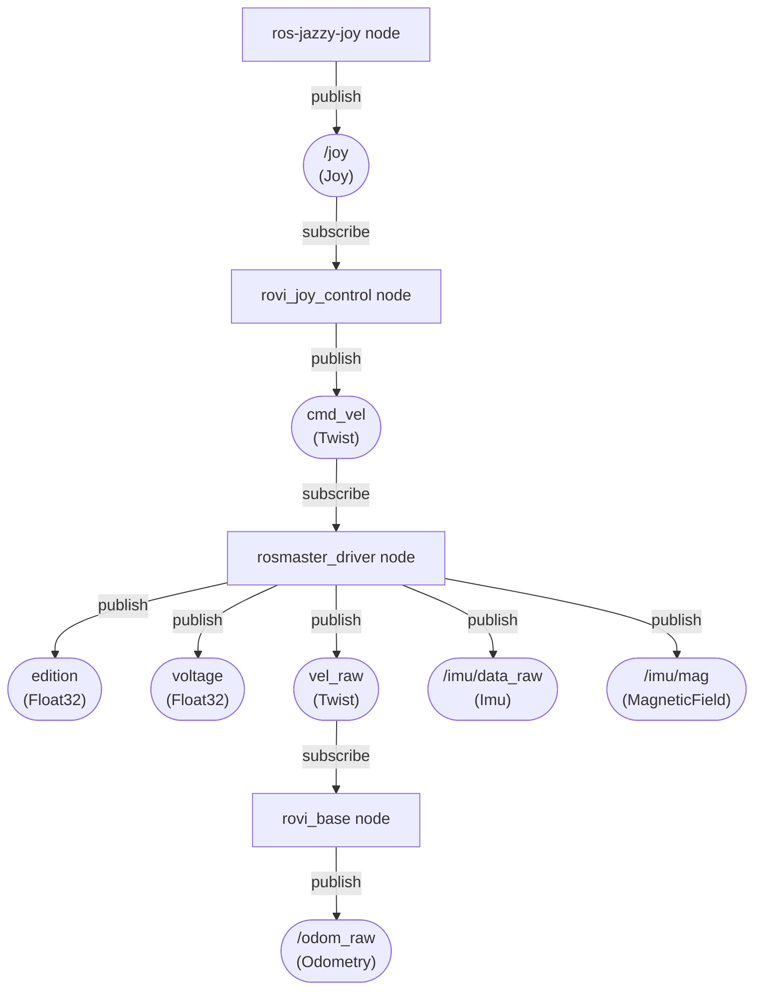

# rovi_ros_ws
ROS2 Jazzy workspace for Room View Bot

# Getting started
1) Install : https://docs.ros.org/en/jazzy/Installation/Ubuntu-Install-Debs.html

2) Install uv (Python package and venv manager):

```bash
curl -LsSf https://astral.sh/uv/install.sh | sh
```

3) Install joystick and rplidar ros packages

```bash
# Teleop + mux
sudo apt install -y ros-jazzy-joy ros-jazzy-teleop-twist-joy ros-jazzy-twist-mux

# Lidar: try apt first; if nothing, use Slamtec’s ROS 2 driver
sudo apt install -y ros-jazzy-rplidar-ros || true
```

4) Test the rplidar
```bash
source /opt/ros/jazzy/setup.bash
ros2 launch rplidar_ros view_rplidar.launch.py
```

## remote robot on windows
when the robot is running in headless mode, it is possible to see the laser output on a windows PC.

As a prerequisites make sure to troubleshout the connection with `ros2 multicast send` and `ros2 multicast receive`, e.g. wsl even with mirror mode might not work on some windows wifi adapters.

Steps :
- run the simple rplidar launch with

```bash
ros2 launch rplidar_ros rplidar.launch.py
```
- add a transform for visualization
```bash
ros2 run tf2_ros static_transform_publisher \
  0 0 0 0 0 0 \
  map laser
```
- then on windows open rviz
```cmd
>pixi shell
>call C:\pixi_ws\ros2-windows\local_setup.bat
>ros2 run rviz2 rviz2
```
- select default `map` on `Global Options/Fixed Frame` add a LaserScan and configure its topic to `/scan`

# Data Flow




## plan
* decide between ros-jazzy-twist-mux and custom rovi_joy_control, what would be easier to configure and maintain


# ELP Stereo camera

```bash
v4l2-ctl --list-devices
v4l2-ctl -d /dev/video0 --list-formats-ext
```
see more details in [stereo camera](./docs/stereo.md)

