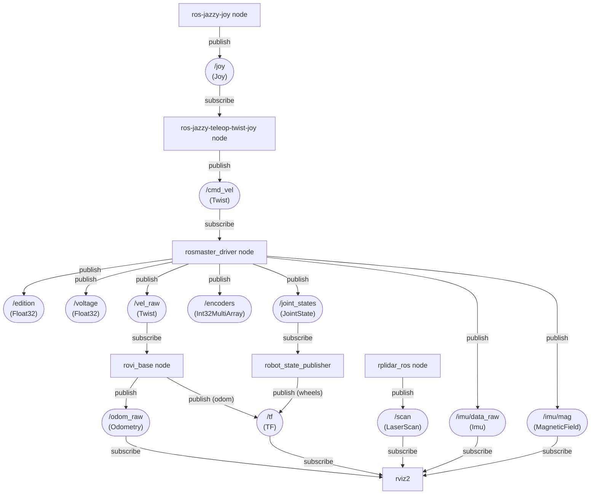
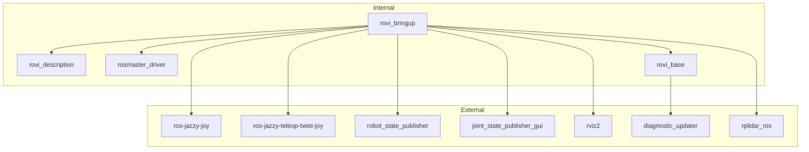

# rovi_ros_ws
ROS2 Jazzy workspace for Room View Bot

# Usage
clone this repo and change to the `rovi_ros_ws` directory then run `uv sync` at least once

clean build and run, notice venv activation after build and before launch :
```bash
source /opt/ros/jazzy/setup.bash
./clean.sh
colcon build
source install/setup.bash
source .venv/bin/activate
```
launch examples:

|command | description |
|--------|-------------|
|ros2 launch rovi_bringup teleop.launch.py | joytick teleoperation of the robot|
|ros2 launch rovi_bringup teleop.launch.py lidar_enabled:=false | teleoperation without lidar |
|ros2 launch rovi_bringup offline_view.launch.py | offline robot model visualization (URDF + joint_state_publisher_gui + RViz) |
|rviz2 -d install/share/rovi_description/rviz/rovi.rviz| visualization of the real robot (after sourcing ROS + install/setup.bash) |

# Install
1) Install : https://docs.ros.org/en/jazzy/Installation/Ubuntu-Install-Debs.html

2) Install uv (Python package and venv manager):

uv needed by the robot for control board python dependencies
```bash
curl -LsSf https://astral.sh/uv/install.sh | sh
```

3) Install joystick and rplidar ros packages

```bash
# Teleop + mux
sudo apt install -y ros-jazzy-joy ros-jazzy-teleop-twist-joy ros-jazzy-twist-mux

# Diagnostics (rovi_base depends on it)
sudo apt install -y ros-jazzy-diagnostic-updater

# Viz + state publisher for offline visualization
sudo apt install -y ros-jazzy-robot-state-publisher ros-jazzy-joint-state-publisher-gui ros-jazzy-rviz2

# Lidar
sudo apt install -y ros-jazzy-rplidar-ros
```

pixi on windows
```cmd
>pixi shell
>call C:\pixi_ws\ros2-windows\local_setup.bat
>colcon build --merge-install --base-paths src --packages-select rovi_description
call install\setup.bat
ros2 launch rovi_description offline_view.launch.py
```


# Diagrams
## Data Flow



## Offline model
This launch from rovi_bringup helps to visualize the robot model without needing the actual robot hardware


## Package dependencies


# Nodes
## rosmaster driver


## wheels

- `ROS-Driver-Board\1.Code\Factory STM32 firmware\Rosmaster_V3.5.1\ControlBoard_Rosmaster\Source\APP\app_mecanum.h`
- `ROS-Driver-Board\1.Code\Factory STM32 firmware\Rosmaster_V3.5.1\V3.5.1\Source\APP\app_motion.h`

```c++
#define MECANUM_MAX_CIRCLE_MM        (251.327f)

#define ENCODER_CIRCLE_205           (2464.0f)

typedef enum _car_type
{
    CAR_MECANUM_MAX = 0x02,//X3 PLUS
} car_type_t;
```
| Motor | wheel |
|-------|-------|
|m1     | Front Left |
|m2     | Front Right |
|m3     | Back Right |
|m4     | Back Left |


| Robot Model        | Wheel diameter (mm) | Wheel encoder steps |
|--------------------|---------------------|---------------------|
| X3                 | 251.327             | 2464                |


## Joystick
| Control           | Axis   | Axis sign | Robot action        | Robot command | command scale sign |
|-------------------|--------|-----------|---------------------|---------------|---------------|
| Left stick right  | axis 0  - | -     | turn clockwise      | axis_angular.yaw | + |
| Left stick left   | axis 0  + | +     | turn anti-clockwise | axis_angular.yaw | + |
| Right stick left  | axis 3  - | -     | move left           | axis_linear.x +  | + |
| Right stick right | axis 3  + | +     | move right          | axis_linear.x -  | + |
| Right stick down  | axis 4  + | +     | move rear           | axis_linear.y -  | - |
| Right stick up    | axis 4  - | -     | move front          | axis_linear.y +  | - |


Check your joystick before starting:
```bash
jstest /dev/input/js0
```

Check joystick → twist without touching the robot hardware:

```bash
ros2 launch rovi_bringup joy.launch.py \
  joy_dev:=0 \
  cmd_vel_topic:=/cmd_vel

ros2 topic echo /cmd_vel
```

- `joy_dev` is the SDL device index (0 ≈ `/dev/input/js0`).
- Override `joy_params_file` or `teleop_params_file` if you keep custom YAMLs elsewhere.


## ELP Stereo camera

```bash
v4l2-ctl --list-devices
v4l2-ctl -d /dev/video0 --list-formats-ext
```
see more details in [stereo camera](./docs/stereo.md)

## rplidar
where testing the rpilidar alone, it is necessary to add a transform for vosulazation

Steps :
- run the simple rplidar launch with

```bash
ros2 launch rplidar_ros rplidar.launch.py
```
- add a transform for visualization
```bash
ros2 run tf2_ros static_transform_publisher \
  0 0 0 0 0 0 \
  map laser
```
- then on windows open rviz
```cmd
>ros2 run rviz2 rviz2
```
- select default `map` on `Global Options/Fixed Frame` add a LaserScan and configure its topic to `/scan`

## wifi adapter
* using AX1800 from BrosTrend model No.: AX4L
* linux install doc https://linux.brostrend.com/
