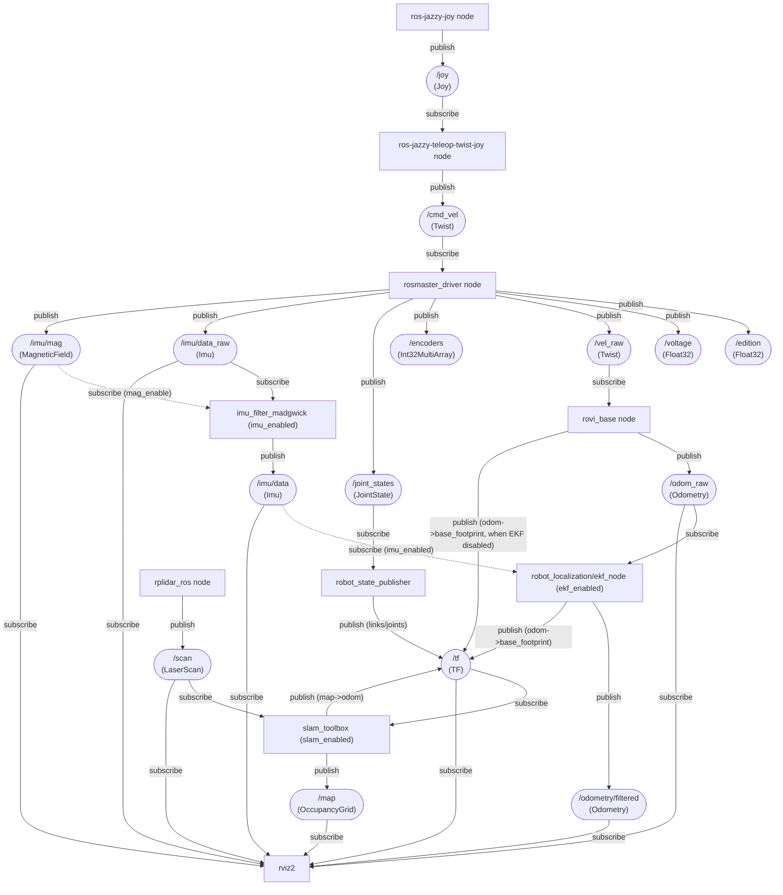
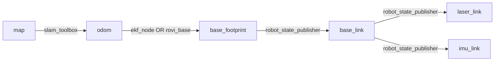
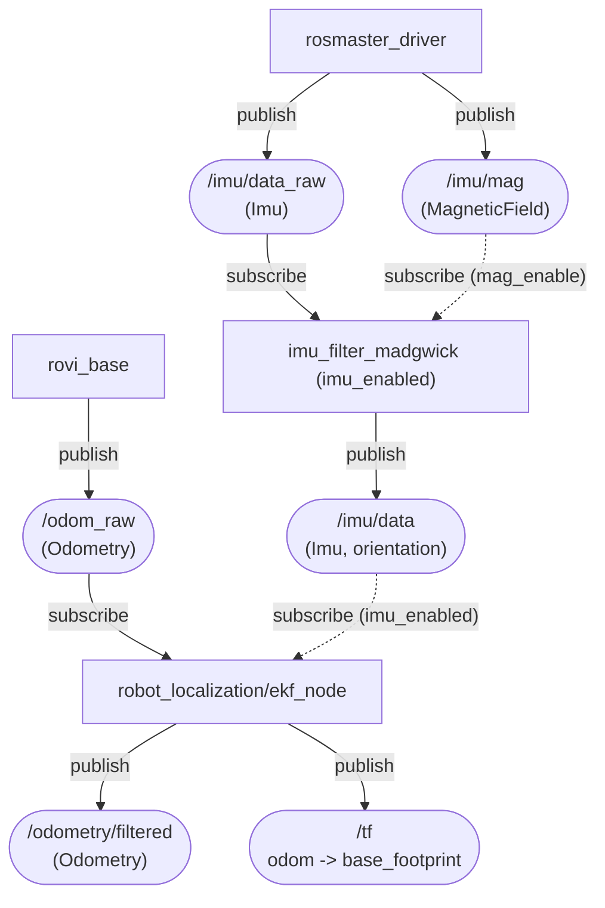
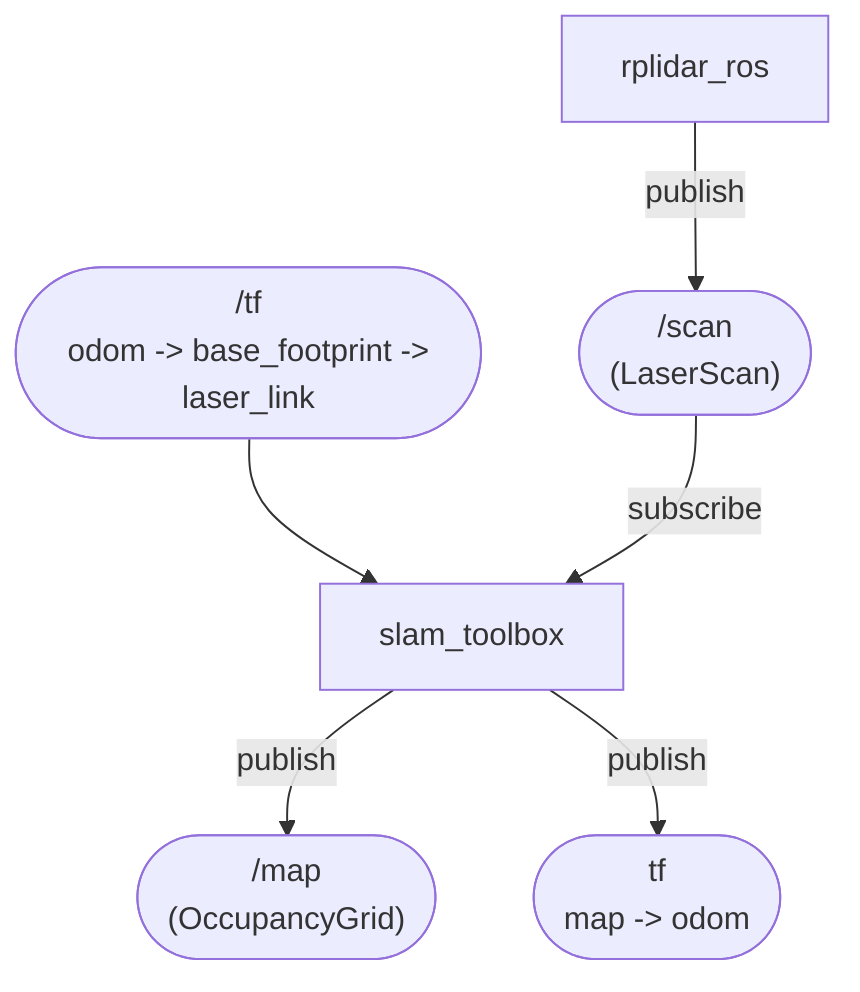
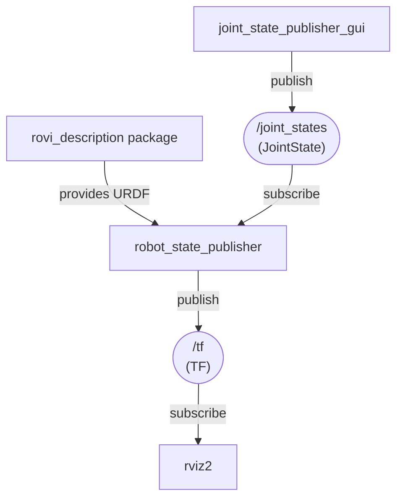
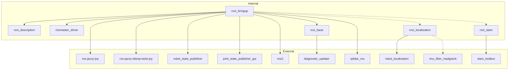

# rovi_ros_ws
ROS2 Jazzy workspace for Room View Bot

# Usage
clone this repo and change to the `rovi_ros_ws` directory then run `uv sync` at least once

clean build and run, notice venv activation after build and before launch :
```bash
source /opt/ros/jazzy/setup.bash
./clean.sh
colcon build
source install/setup.bash
source .venv/bin/activate
```
launch examples:

|command | description |
|--------|-------------|
|ros2 launch rovi_bringup teleop.launch.py | joytick teleoperation of the robot|
|ros2 launch rovi_bringup teleop.launch.py lidar_enabled:=false | teleoperation without lidar |
|ros2 launch rovi_bringup offline_view.launch.py | offline robot model visualization (URDF + joint_state_publisher_gui + RViz) |
|rviz2 -d install/share/rovi_description/rviz/rovi.rviz| visualization of the real robot (after sourcing ROS + install/setup.bash) |

## SLAM + localization (clean layering)
Goal: add `map -> odom` TF (SLAM) so RViz can use `map` as the fixed frame (real-room/global), not only `odom` (local/drifty).

### Packages
| Package | Role |
|---|---|
| `rovi_bringup` | Top-level launch entry points (teleop, visualization, mapping/localization stacks) |
| `rovi_description` | URDF + meshes + RViz configs; provides static TF like `base_footprint -> base_link -> laser_link` |
| `rosmaster_driver` | Hardware bridge: `/cmd_vel` → MCU, publishes `/vel_raw`, `/joint_states`, `/imu/data_raw`, `/imu/mag`, etc. |
| `rovi_base` | Odometry integrator: `/vel_raw` → `/odom_raw`; publishes TF `odom -> base_footprint` when EKF is disabled |
| `rovi_localization` | Localization pipeline: IMU orientation filter + EKF; publishes `/odometry/filtered` and TF `odom -> base_footprint` when enabled |
| `rovi_slam` | SLAM pipeline (`slam_toolbox`): publishes `/map` and TF `map -> odom` when enabled |

### Launches
| Package | Launch | Description |
|---|---|---|
| `rovi_bringup` | `teleop.launch.py` | Manual driving: joystick + teleop + base bringup (+ LiDAR if enabled) |
| `rovi_bringup` | `offline_view.launch.py` | Offline visualization: URDF + joint_state_publisher_gui + RViz |
| `rovi_bringup` | `joy.launch.py` | Debug joystick → `/cmd_vel` only (no hardware required) |
| `rosmaster_driver` | `rosmaster_driver.launch.py` | Hardware driver only (serial/IMU/joints sanity checks) |
| `rovi_bringup` | `mapping.launch.py` | Bringup + SLAM mapping (`slam_toolbox`) |
| `rovi_bringup` | `localization.launch.py` | Bringup + SLAM localization on an existing map (`slam_toolbox` localization mode) |
| `rovi_localization` | `ekf.launch.py` | Component launch: IMU filter + EKF (useful to test/fuse odometry without SLAM) |
| `rovi_slam` | `slam_toolbox.launch.py` | Component launch: `slam_toolbox` (mapping/localization selected by params) |

### Params
| Package | Launch | Param | Default | Explanation |
|---|---|---|---|---|
| `rovi_bringup` | `teleop.launch.py` | `lidar_enabled` | `true` | Starts LiDAR driver (`rplidar_ros`); without it there is no `/scan` |
| `rovi_bringup` | `mapping.launch.py`, `localization.launch.py` | `slam_enabled` | `true` | Starts `slam_toolbox`; publishes TF `map -> odom` (and `/map` in mapping mode) |
| `rovi_bringup` | `mapping.launch.py`, `localization.launch.py` | `ekf_enabled` | `false` | Starts `robot_localization/ekf_node` and makes it the only TF source for `odom -> base_footprint` (disables TF from `rovi_base`) |
| `rovi_bringup` | `mapping.launch.py`, `localization.launch.py` | `imu_enabled` | `false` | Starts IMU orientation filter and fuses IMU into EKF (keeps EKF odom-only when `false`) |
| `rovi_bringup` | `mapping.launch.py`, `localization.launch.py` | `mag_enable` | `false` | Enables magnetometer input for the IMU filter (disabled by default due to interference risk) |

# Install
1) Install : https://docs.ros.org/en/jazzy/Installation/Ubuntu-Install-Debs.html

2) Install uv (Python package and venv manager):

uv needed by the robot for control board python dependencies
```bash
curl -LsSf https://astral.sh/uv/install.sh | sh
```

3) Install joystick and rplidar ros packages

```bash
# Teleop + mux
sudo apt install -y ros-jazzy-joy ros-jazzy-teleop-twist-joy ros-jazzy-twist-mux

# Diagnostics (rovi_base depends on it)
sudo apt install -y ros-jazzy-diagnostic-updater

# Viz + state publisher for offline visualization
sudo apt install -y ros-jazzy-robot-state-publisher ros-jazzy-joint-state-publisher-gui ros-jazzy-rviz2

# Lidar
sudo apt install -y ros-jazzy-rplidar-ros

# SLAM + localization
sudo apt install -y ros-jazzy-slam-toolbox ros-jazzy-robot-localization

# IMU orientation filter (used when imu_enabled:=true)
sudo apt install -y ros-jazzy-imu-filter-madgwick
```

pixi on windows
```cmd
>pixi shell
>call C:\pixi_ws\ros2-windows\local_setup.bat
>colcon build --merge-install --base-paths rovi_ros_ws --packages-select rovi_description
call install\setup.bat
rviz2 -d install/share/rovi_description/rviz/rovi.rviz
```


# Diagrams
## Data Flow



## TF Tree (runtime)
TF frames are not regular ROS topics; this is the chain RViz and SLAM use at runtime.



## Localization (EKF + IMU filter)
This produces a single authoritative `odom -> base_footprint` transform; IMU fusion is gated by `imu_enabled` and magnetometer usage by `mag_enable`.



## SLAM (slam_toolbox)
This produces `map -> odom` so the robot pose is expressed in a stable map frame.



## Offline model
This launch from rovi_bringup helps to visualize the robot model without needing the actual robot hardware



## Package dependencies


# Nodes
## rosmaster driver


## wheels

- `ROS-Driver-Board\1.Code\Factory STM32 firmware\Rosmaster_V3.5.1\ControlBoard_Rosmaster\Source\APP\app_mecanum.h`
- `ROS-Driver-Board\1.Code\Factory STM32 firmware\Rosmaster_V3.5.1\V3.5.1\Source\APP\app_motion.h`

```c++
#define MECANUM_MAX_CIRCLE_MM        (251.327f)

#define ENCODER_CIRCLE_205           (2464.0f)

typedef enum _car_type
{
    CAR_MECANUM_MAX = 0x02,//X3 PLUS
} car_type_t;
```
| Motor | wheel | direction |
|-------|-------|-----------|
|m1     | Front Left | flip |
|m2     | Front Right | |
|m3     | Back Left | |
|m4     | Back Right | flip |


| Robot Model        | Wheel diameter (mm) | Wheel encoder steps |
|--------------------|---------------------|---------------------|
| X3                 | 251.327             | 2464                |


## Joystick
| Control           | Axis   | Axis sign | Robot action        | Robot command | command scale sign |
|-------------------|--------|-----------|---------------------|---------------|---------------|
| Left stick right  | axis 0  - | -     | turn clockwise      | axis_angular.yaw | + |
| Left stick left   | axis 0  + | +     | turn anti-clockwise | axis_angular.yaw | + |
| Right stick left  | axis 3  - | -     | move left           | axis_linear.x +  | + |
| Right stick right | axis 3  + | +     | move right          | axis_linear.x -  | + |
| Right stick down  | axis 4  + | +     | move rear           | axis_linear.y -  | - |
| Right stick up    | axis 4  - | -     | move front          | axis_linear.y +  | - |


Check your joystick before starting:
```bash
jstest /dev/input/js0
```

Check joystick → twist without touching the robot hardware:

```bash
ros2 launch rovi_bringup joy.launch.py \
  joy_dev:=0 \
  cmd_vel_topic:=/cmd_vel

ros2 topic echo /cmd_vel
```

- `joy_dev` is the SDL device index (0 ≈ `/dev/input/js0`).
- Override `joy_params_file` or `teleop_params_file` if you keep custom YAMLs elsewhere.


## ELP Stereo camera

```bash
v4l2-ctl --list-devices
v4l2-ctl -d /dev/video0 --list-formats-ext
```
see more details in [stereo camera](./docs/stereo.md)

## rplidar
where testing the rpilidar alone, it is necessary to add a transform for vosulazation

Steps :
- run the simple rplidar launch with

```bash
ros2 launch rplidar_ros rplidar.launch.py
```
- add a transform for visualization
```bash
ros2 run tf2_ros static_transform_publisher \
  0 0 0 0 0 0 \
  map laser
```
- then on windows open rviz
```cmd
>ros2 run rviz2 rviz2
```
- select default `map` on `Global Options/Fixed Frame` add a LaserScan and configure its topic to `/scan`

## wifi adapter
* using AX1800 from BrosTrend model No.: AX4L
* linux install doc https://linux.brostrend.com/
