# rovi_ros_ws
ROS2 Jazzy workspace for Room View Bot

# Usage
For first time usage, see [install](#install) for details

## Config in `~/.bashrc`
Add these lines to your real `~/.bashrc`:

```bash
export ROVI_ROS_WS_DIR="$HOME/dev/Roblibs/rovi_ros_ws"
source "$ROVI_ROS_WS_DIR/rovi_env.sh"
```

## Commands
Commands provided by `rovi_env.sh`

| Command | Description |
|---|---|
| `ws` | Changes to `$ROVI_ROS_WS_DIR`, runs `setup`, and (if present) activates `.venv`. |
| `build` | Runs `colcon build` in this workspace. This generates/updates the `install/` overlay used by `ros2 launch`. |
| `stop` | Stops ROS/Gazebo/RViz processes that belong to this workspace (use `stop --all` for an aggressive full user hard-stop). |
| `setup` | Sources `rovi_ros_ws/install/setup.bash` (after a successful build). This overlays workspace packages (e.g., `rovi_bringup`) into your current shell. |
| `activate` | Activates `rovi_ros_ws/.venv` (created by `uv sync`). This provides Python dependencies needed by the real-robot stack (notably `rosmaster_driver`). |
| `teleop` | Robot (Pi): runs `rovi_bringup/rovi.launch.py` with `robot_mode:=real stack:=teleop` (headless; no RViz). |
| `keyboard` | Runs `tools/rovi_keyboard.py` in the current terminal and publishes `/cmd_vel_keyboard` for `twist_mux` (run in its own terminal). |
| `mapping` | Robot (Pi): runs `rovi_bringup/rovi.launch.py` with `robot_mode:=real stack:=mapping` (headless; no RViz). |
| `localization` | Robot (Pi): runs `rovi_bringup/rovi.launch.py` with `robot_mode:=real stack:=localization` (headless; no RViz). |
| `nav` | Robot (Pi): runs `rovi_bringup/rovi.launch.py` with `robot_mode:=real stack:=nav` (headless; no RViz). |
| `sim` | Simulation shortcut: `sim` (default mapping) or `sim teleop|mapping|localization|nav` runs `rovi_bringup/rovi.launch.py robot_mode:=sim stack:=...` and starts Gazebo + RViz by default (`rviz:=false` for headless). |
| `view` | PC only: starts `rviz2` with `rovi_description/rviz/rovi_map.rviz` (Fixed Frame: `map`). Use with `mapping` or `localization` running on the robot. |
| `view_nav` | PC only: starts `rviz2` with `rovi_description/rviz/rovi_nav.rviz` (Nav2 panel; Fixed Frame: `map`). Use with `nav` running on the robot. |
| `view_teleop` | PC only: starts `rviz2` with `rovi_description/rviz/rovi_odom.rviz` (Fixed Frame: `odom`). Use with `teleop` running on the robot. |
| `view_offline` | Local only: runs `rovi_bringup/rovi.launch.py robot_mode:=offline stack:=offline` (URDF inspection without robot hardware). |

## Where to run what
- **Robot (Pi):** `teleop`, `mapping`, `localization`, `nav` (RViz is always off on the robot).
- **PC (optional):** `view` / `view_nav` / `view_teleop` (pure visualization; no robot nodes).
- **Simulation (PC):** `sim` (starts Gazebo + stack + RViz together).

# Install

* Install : https://docs.ros.org/en/jazzy/Installation/Ubuntu-Install-Debs.html

* Install uv (Python package and venv manager):

uv needed by the robot for control board python dependencies
```bash
curl -LsSf https://astral.sh/uv/install.sh | sh
```
* clone this repo under `~/dev/Roblibs/rovi_ros_ws` change it then run `uv sync`

* Install all the needed depedencies ros packages

```bash
sudo apt install -y \
  ros-jazzy-joy \
  ros-jazzy-teleop-twist-joy \
  ros-jazzy-twist-mux \
  ros-jazzy-diagnostic-updater \
  ros-jazzy-robot-state-publisher \
  ros-jazzy-joint-state-publisher \
  ros-jazzy-joint-state-publisher-gui \
  ros-jazzy-rviz2 \
  ros-jazzy-rplidar-ros \
  ros-jazzy-slam-toolbox \
  ros-jazzy-robot-localization \
  ros-jazzy-nav2-bringup \
  ros-jazzy-nav2-rviz-plugins \
  ros-jazzy-imu-filter-madgwick \
  ros-jazzy-ros-gz-sim \
  ros-jazzy-ros-gz-bridge
```

## wsl
When using Windows Subsystem for Linux, it is necessary to ensure the following :
- Windwos Network: network is private, not public.
- WSL Settings: Networking, Networking mode 'Mirrored'
- Firewall config :

```bash
Set-NetConnectionProfile -InterfaceAlias "WiFi" -NetworkCategory Private

New-NetFirewallRule -DisplayName "Allow ICMPv4 Echo from robot" -Direction Inbound -Action Allow -Protocol ICMPv4 -IcmpType 8 -RemoteAddress 10.0.0.180 -Profile Private

New-NetFirewallRule -DisplayName "Allow ROS2 DDS UDP from robot" -Direction Inbound -Action Allow -Protocol UDP -LocalPort 7400-7600 -RemoteAddress 10.0.0.180 -Profile Private
```

# Description
## Packages
Packages of this repo are listed in this table

| Package | Role |
|---|---|
| `rovi_bringup` | Top-level launch entry points (teleop, visualization, mapping/localization stacks) |
| `rovi_sim` | Gazebo Sim backend: worlds + bridges + `rovi_sim_base` + `rovi_gz_odom`; spawns the shared robot model from `rovi_description` into Gazebo Sim |
| `rovi_description` | URDF + meshes + RViz configs; provides static TF like `base_footprint -> base_link -> laser_link` |
| `rosmaster_driver` | Hardware bridge: `/cmd_vel` → MCU, publishes `/vel_raw`, `/joint_states`, `/imu/data_raw`, `/imu/mag`, etc. |
| `rovi_base` | Odometry integrator (real robot): `/vel_raw` → `/odom_raw`; can publish TF `odom -> base_footprint` (raw odom). In simulation, `/odom_raw` comes from Gazebo ground truth. |
| `rovi_localization` | Odometry filtering pipeline: IMU orientation filter + EKF; publishes `/odometry/filtered` and TF `odom -> base_footprint` |
| `rovi_slam` | SLAM pipeline (`slam_toolbox`): publishes `/map` and TF `map -> odom` when enabled |
| `rovi_nav` | Nav2 integration package: configuration + component launch for autonomous navigation |

External ROS packages installed via apt (and a couple of local tools) and how they are used in this workspace:

| Dependency | Description |
|---|---|
| `ros-jazzy-joy` | Used by `rovi_bringup/teleop.launch.py` to start `joy_node` and publish `/joy` from the joystick device. |
| `ros-jazzy-teleop-twist-joy` | Used by `rovi_bringup/teleop.launch.py` to convert `/joy` into `/cmd_vel_joy`, using `rovi_bringup/config/teleop_twist_joy.yaml`. |
| `tools/rovi_keyboard.py` | Keyboard teleop (`keyboard` command) that publishes `/cmd_vel_keyboard` (`geometry_msgs/msg/Twist`) and is muxed via `twist_mux` like joystick and Nav2. |
| `ros-jazzy-twist-mux` | Used by `rovi_bringup/teleop.launch.py` to mux joystick `/cmd_vel_joy`, keyboard `/cmd_vel_keyboard`, and Nav2 `/cmd_vel_nav` into the final `/cmd_vel` topic consumed by the robot backend. |
| `ros-jazzy-diagnostic-updater` | Used by `rovi_base` to publish runtime diagnostics (for example on `/diagnostics`). |
| `ros-jazzy-robot-state-publisher` | Used by `rovi_bringup/robot_bringup.launch.py` (all modes) to publish the TF tree from the `rovi_description` URDF and provide `/robot_description` to RViz. |
| `ros-jazzy-joint-state-publisher-gui` | Used by `rovi_bringup/robot_bringup.launch.py` in `robot_mode=offline` for interactive URDF inspection. |
| `ros-jazzy-rviz2` | Used by `view` / `view_teleop` (PC viewer commands) and by `rovi_bringup/rovi.launch.py` in `robot_mode=sim|offline` (optional auto-start). |
| `ros-jazzy-rplidar-ros` | Used by `rovi_bringup/robot_bringup.launch.py` (robot_mode=real, `lidar_enabled:=true`) to publish `/scan` for SLAM and Nav2. |
| `ros-jazzy-ros-gz-sim` | Used by `rovi_sim/gazebo_sim.launch.py` to start Gazebo Sim and spawn the simulated robot + world. |
| `ros-jazzy-ros-gz-bridge` | Used by `rovi_sim/gazebo_sim.launch.py` to bridge Gazebo topics (e.g., LiDAR + `/clock`) into ROS 2 topics like `/scan` and `/clock`. |
| `ros-jazzy-slam-toolbox` | Used via `rovi_slam/slam_toolbox.launch.py` (included by `mapping`, `localization`, and `nav`) to publish `/map` and TF `map -> odom`. |
| `ros-jazzy-robot-localization` | Used by `rovi_localization/ekf.launch.py` (included by `mapping`, `localization`, and `nav`) to publish `/odometry/filtered` and TF `odom -> base_footprint`. |
| `ros-jazzy-nav2-bringup` | Provides Nav2 servers started by `rovi_nav/launch/nav.launch.py` for goal-based navigation (planner/controller/BT navigator/behaviors). |
| `ros-jazzy-nav2-rviz-plugins` | Required by `rovi_nav.rviz` so RViz can show the Nav2 panel and tools (initial pose + goal) when `nav` is running. |
| `ros-jazzy-imu-filter-madgwick` | Used when `odom_mode=fusion_wheels_imu` to filter `/imu/data_raw` (and optionally `/imu/mag`) into `/imu/data` for the EKF. |

## Launches
| Launch | Package | Description |
|---|---|---|
| `rovi.launch.py` | `rovi_bringup` | Unified entrypoint (selects `stack` + `robot_mode`, owns RViz startup policy). |
| `robot_bringup.launch.py` | `rovi_bringup` | Backend selector: real drivers / Gazebo sim / offline URDF, exposing the stable topic contract (`/scan`, `/imu/data_raw`, `/cmd_vel`, etc.). |
| `teleop.launch.py` | `rovi_bringup` | Control stack only: joystick → `/cmd_vel_joy` + `twist_mux` → `/cmd_vel` (backend must already be running). |
| `mapping.launch.py` | `rovi_bringup` | Mapping stack only: EKF + `slam_toolbox` (mapping mode). |
| `localization.launch.py` | `rovi_bringup` | Localization stack only: EKF + `slam_toolbox` (localization mode, loads `map_file_name`). |
| `nav.launch.py` | `rovi_bringup` | Navigation stack only: mapping/localization + Nav2 (publishes `/cmd_vel_nav`). |
| `offline_view.launch.py` | `rovi_bringup` | Legacy offline inspection: `robot_mode=offline` + RViz (superseded by `view_offline` / `rovi.launch.py`). |
| `joy.launch.py` | `rovi_bringup` | Debug joystick → `/cmd_vel` only (no hardware required) |
| `gazebo_sim.launch.py` | `rovi_sim` | Gazebo Sim backend: starts Gazebo + bridges + spawns the robot model (used when `robot_mode=sim`) |
| `rosmaster_driver.launch.py` | `rosmaster_driver` | Hardware driver only (serial/IMU/joints sanity checks) |
| `ekf.launch.py` | `rovi_localization` | Component launch: odometry pipeline (`odom_mode` selects raw/filtered/fusion_wheels_imu; useful without SLAM) |
| `slam_toolbox.launch.py` | `rovi_slam` | Component launch: `slam_toolbox` (mapping/localization selected by params) |
| `nav.launch.py` | `rovi_nav` | Component launch: Nav2 servers + lifecycle manager |

## Nodes
ROS nodes started by the launches above (some are conditional based on params).

| Node | Package | Description |
|---|---|---|
| `joy_node` | `joy` | Reads a joystick device and publishes `/joy` (`sensor_msgs/msg/Joy`). |
| `teleop_twist_joy` | `teleop_twist_joy` | Converts `/joy` into velocity commands on `/cmd_vel_joy` (`geometry_msgs/msg/Twist`). |
| `rovi_keyboard` | `tools/rovi_keyboard.py` | Keyboard teleop tool that publishes `/cmd_vel_keyboard` (`geometry_msgs/msg/Twist`) (run via the `keyboard` command in its own terminal). |
| `twist_mux` | `twist_mux` | Selects the active velocity command source (e.g., `/cmd_vel_nav` vs `/cmd_vel_joy`) and publishes `/cmd_vel`. |
| `rosmaster_driver` | `rosmaster_driver` | Hardware bridge for the Rosmaster base board: subscribes to `/cmd_vel` and publishes feedback like `/vel_raw`, `/joint_states`, `/imu/data_raw`, `/imu/mag`, and `/voltage`. |
| `rovi_base` | `rovi_base` | Integrates `/vel_raw` into `/odom_raw` and can broadcast TF `odom -> base_footprint` when enabled. |
| `robot_state_publisher` | `robot_state_publisher` | Publishes the robot TF tree from the URDF (`robot_description`) and `/joint_states`. |
| `rplidar_composition` | `rplidar_ros` | Publishes `/scan` (`sensor_msgs/msg/LaserScan`) from an RPLIDAR (only when `lidar_enabled:=true`). |
| `parameter_bridge` | `ros_gz_bridge` | Bridges Gazebo Transport topics into ROS 2 topics (used by simulation for `/scan`, `/clock`, and `/imu/data_raw`). |
| `rovi_sim_base` | `rovi_sim` | Simulation base: subscribes `/cmd_vel`, applies acceleration limits, and publishes `/cmd_vel_sim` (to Gazebo) + `/vel_raw` (to `rovi_base`). |
| `imu_filter` | `imu_filter_madgwick` | Filters `/imu/data_raw` (and optionally `/imu/mag`) into `/imu/data` (only when `odom_mode:=fusion_wheels_imu`). |
| `ekf_filter_node` | `robot_localization` | EKF that produces `/odometry/filtered` and TF `odom -> base_footprint` from `/odom_raw` (and `/imu/data` in `fusion_wheels_imu`). |
| `slam_toolbox` | `slam_toolbox` | Lifecycle SLAM node that publishes TF `map -> odom` and (in mapping mode) `/map` (only when `slam_enabled:=true`). |
| `odom_to_basefootprint` | `tf2_ros` | Static TF publisher used by `offline_view.launch.py` to provide `odom -> base_footprint` without hardware. |
| `joint_state_publisher_gui` | `joint_state_publisher_gui` | GUI for publishing `/joint_states` for offline URDF inspection. |
| `rviz2` | `rviz2` | Visualization client (used by `offline_view.launch.py` and standalone `rviz2 -d ...`). |
| `bt_navigator` | `nav2_bt_navigator` | Nav2 behavior tree navigator; provides the `/navigate_to_pose` action server. |
| `planner_server` | `nav2_planner` | Nav2 global planner that produces paths in the `map` frame. |
| `controller_server` | `nav2_controller` | Nav2 local controller that publishes velocity commands on `/cmd_vel_nav`. |
| `behavior_server` | `nav2_behaviors` | Nav2 recovery/behavior actions (spin, backup, wait) used by the BT. |
| `lifecycle_manager_navigation` | `nav2_lifecycle_manager` | Configures and activates the Nav2 lifecycle nodes (autostart). |

## Params
Only the parameters toggeling nodes activation are listed here

| Param | Package | Launch | Default | Explanation |
|---|---|---|---|---|
| `robot_mode` | `rovi_bringup` | `rovi.launch.py`, `robot_bringup.launch.py` | `real` | Selects the robot backend: `real`, `sim`, or `offline`. |
| `stack` | `rovi_bringup` | `rovi.launch.py` | `teleop` | Selects the stack to run: `teleop`, `mapping`, `localization`, `nav`, `offline`, `bringup`. |
| `rviz` | `rovi_bringup` | `rovi.launch.py` | auto | Starts RViz automatically (default **off** for `real`, **on** for `sim`/`offline`). |
| `joy_enabled` | `rovi_bringup` | `rovi.launch.py`, `teleop.launch.py` | auto | Starts joystick nodes (default **on** for `real`, **off** for `sim`). |
| `lidar_enabled` | `rovi_bringup` | `robot_bringup.launch.py` | `true` | Starts LiDAR driver (`rplidar_ros`) in `robot_mode=real`; without it there is no `/scan`. |
| `slam_enabled` | `rovi_bringup` | `mapping.launch.py`, `localization.launch.py`, `rovi.launch.py` | `true` | Starts `slam_toolbox`; publishes TF `map -> odom` (and `/map` in mapping mode). |
| `slam_enabled` | `rovi_slam` | `slam_toolbox.launch.py` | `true` | Starts `slam_toolbox`; publishes TF `map -> odom` (and `/map` in mapping mode) |
| `slam_mode` | `rovi_slam` | `slam_toolbox.launch.py` | `mapping` | Selects SLAM mode: `mapping` or `localization`. |
| `slam_mode` | `rovi_bringup` | `nav.launch.py`, `rovi.launch.py` | `mapping` | Selects SLAM mode when running Nav2. |
| `odom_mode` | `rovi_bringup` | `mapping.launch.py`, `localization.launch.py`, `nav.launch.py`, `rovi.launch.py` | `fusion_wheels_imu` | Selects who publishes TF `odom -> base_footprint` (and whether IMU is used in that odom estimate) |
| `odom_mode` | `rovi_localization` | `ekf.launch.py` | `fusion_wheels_imu` | Same as above, but for running the odometry pipeline without SLAM |
| `mag_enabled` | `rovi_bringup` | `mapping.launch.py`, `localization.launch.py`, `nav.launch.py`, `rovi.launch.py` | `false` | Enables magnetometer input for the IMU filter (used in `odom_mode=fusion_wheels_imu`; disabled by default due to interference risk) |
| `mag_enabled` | `rovi_localization` | `ekf.launch.py` | `false` | Enables magnetometer input for the IMU filter (used in `odom_mode=fusion_wheels_imu`; disabled by default due to interference risk) |
| `map_file_name` | `rovi_bringup` | `localization.launch.py`, `nav.launch.py`, `rovi.launch.py` | `~/.ros/rovi/maps/latest.posegraph` | Pose-graph file to load when `slam_mode=localization`. |

### Robot modes
| `robot_mode` | Intended machine | Backend (started by `robot_bringup.launch.py`) | `use_sim_time` | RViz default |
|---|---|---|---|---|
| `real` | robot (Pi) | real drivers + sensors | `false` | `off` |
| `sim` | PC | Gazebo Sim backend (+ ground-truth odom) | `true` | `on` |
| `offline` | PC | URDF inspection only | `false` | `on` |

### Odometry Modes
Used by: `rovi_bringup/mapping.launch.py`, `rovi_bringup/localization.launch.py`, and `rovi_localization/ekf.launch.py`.

| `odom_mode` | `rovi_base_publish_tf` (bringup) | TF `odom -> base_footprint` | Nodes started | Notes |
|---|---|---|---|---|
| `raw` | `true` | `rovi_base` (real) / `rovi_gz_odom` (sim) | (none) | Fastest/simplest; no `/odometry/filtered` |
| `filtered` | `false` | `robot_localization/ekf_node` | `robot_localization/ekf_node` | Filters wheel odom (`/odom_raw` → `/odometry/filtered`) |
| `fusion_wheels_imu` | `false` | `robot_localization/ekf_node` | `imu_filter_madgwick` + `robot_localization/ekf_node` | Adds IMU yaw + yaw rate (`/imu/data_raw` → `/imu/data`); set `mag_enabled:=true` to use `/imu/mag` |

# Diagrams
Conventions:
- Square nodes are ROS nodes/packages.
- Rounded nodes are ROS topics (`/name<br/>(MsgType)`).
- In connection to topics, arrows only represent publish/subscribe via a topic.

## Robot Modes
This diagram shows the unification: higher-level launches stay the same, and `robot_mode` selects the backend that provides the robot interface.

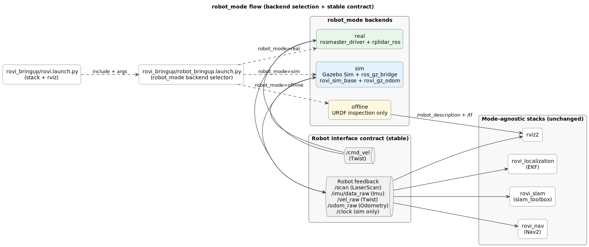

## Real robot
control board + sensors

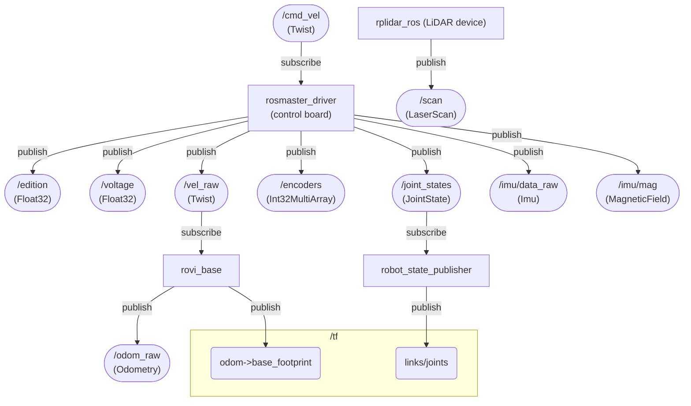

## Manual control
joystick + keyboard

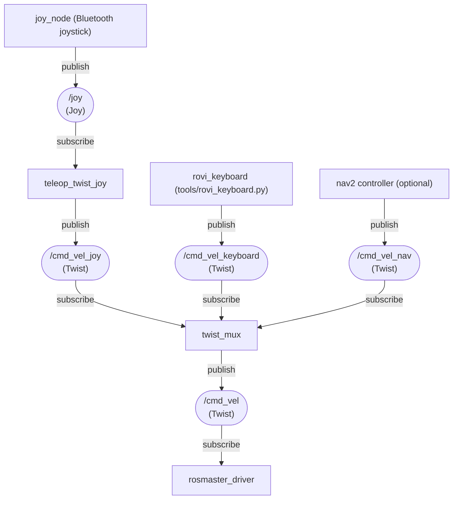

## Odometry filtering
When odom_mode=fusion_wheels_imu, this produces a single authoritative `odom -> base_footprint` transform using EKF + IMU. For `odom_mode=filtered`, omit the IMU branch; magnetometer usage is gated by `mag_enabled`.


## SLAM
slam_toolbox produces `map -> odom` so the robot pose is expressed in a stable map frame. `slam_mode` selects `mapping` (build/update the map) or `localization` (load a saved pose-graph from `map_file_name`).

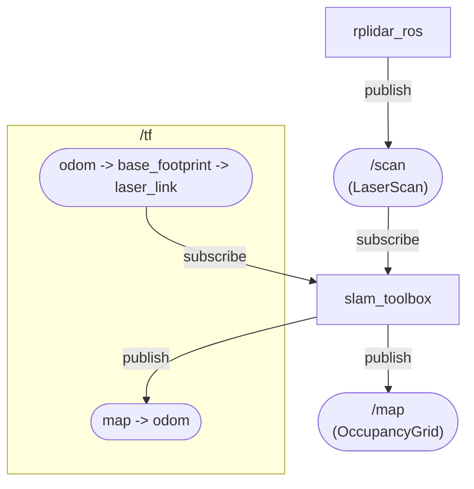

## Navigation
Nav2 consumes map + TF + sensors to compute `/cmd_vel` for the base.
For navigation, SLAM can run in `slam_mode=mapping` (default) or `slam_mode=localization` (requires `map_file_name`).

Lifecycle-managed nodes (configured/activated by `nav2_lifecycle_manager`): `nav2_bt_navigator/bt_navigator`, `nav2_planner/planner_server`, `nav2_controller/controller_server`, `nav2_behaviors/behavior_server`.

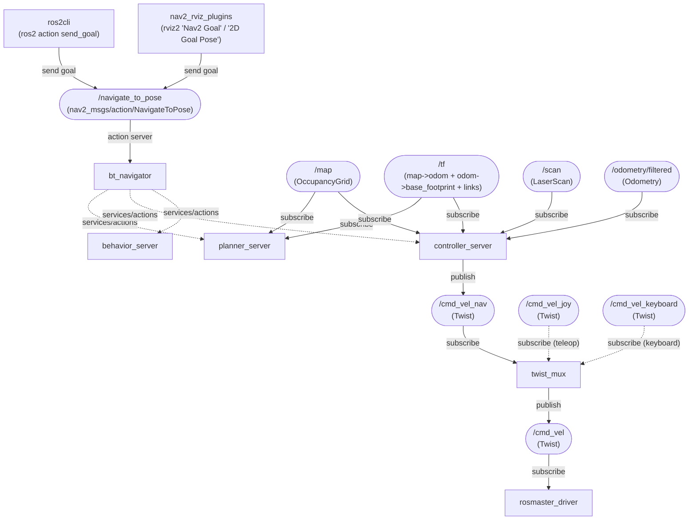

## Visualization

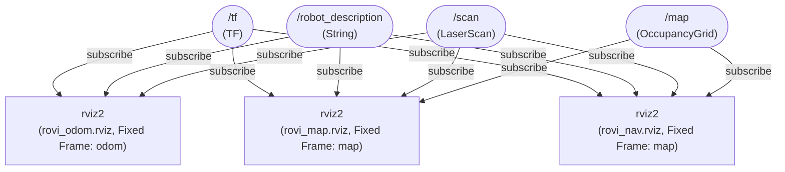

## Offline model (robot_mode=offline)
This launch from `rovi_bringup` helps to visualize the robot model without needing the actual robot hardware. In the target `robot_mode` design, this corresponds to `robot_mode=offline`.


## Simulation (Gazebo Sim backend, robot_mode=sim)
This is the additional wiring introduced by simulation. In the target `robot_mode` design this becomes the `robot_mode=sim` backend, while `rovi_localization` / `rovi_slam` / `rovi_nav` remain unchanged.

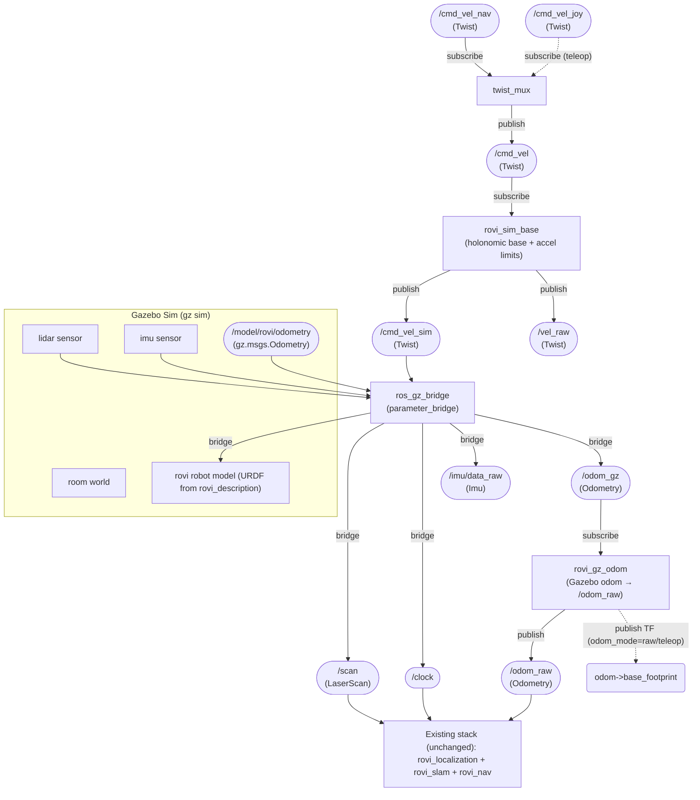

## TF Tree
TF frames are not regular ROS topics; this is the chain RViz and SLAM use at runtime.

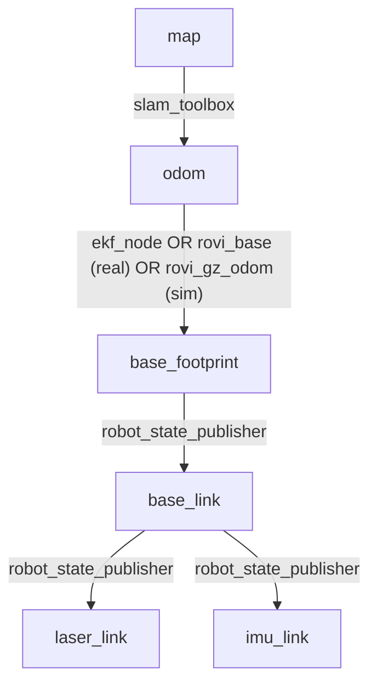

## Launch wiring (current)
`rovi_bringup` launches are composition layers: they include smaller "component" launches (teleop, odometry, SLAM). This keeps packages reusable (e.g., you can run SLAM against bag playback as long as `/scan` + TF exist).

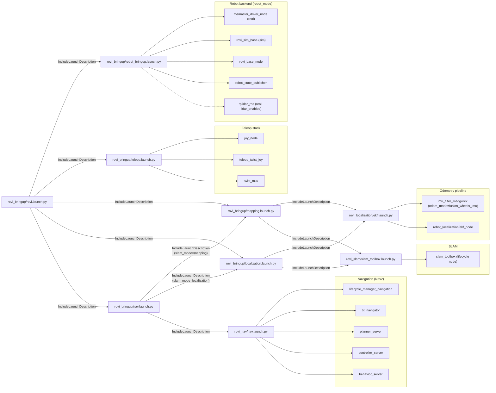

## Launch wiring (target with `robot_mode`)
`rovi_bringup/robot_bringup.launch.py` selects the backend (`robot_mode:=real|sim|offline`), and `rovi_bringup/rovi.launch.py` is the single high-level entrypoint that chooses the stack and owns RViz startup policy.

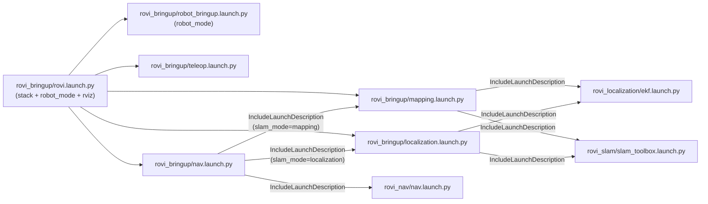

## Package dependencies
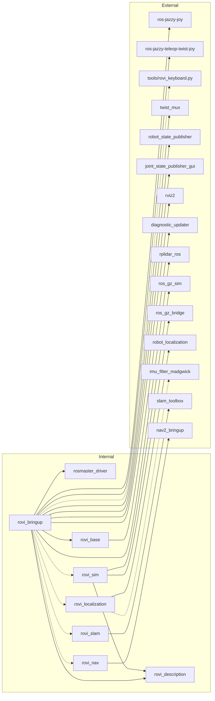

# Nodes details
## Rosbags record play

`record` and `play` are lightweight helpers around `ros2 bag`.

- Default bag directory: `~/.ros/rovi/bags/`
- Current launch is tracked in: `~/.ros/rovi/session/current_launch` (written automatically when running `teleop`, `mapping`, `localization`, `nav`)
- Topic filters are configured in: `src/rovi_bringup/config/bag_topics.yaml`

`bag_topics.yaml` format: top-level keys are launch *base names* (`teleop`, `nav`, ...), values are the topic list to record.

Examples:

```bash
record
record nav
play
play nav
```

## Robot backend contract
Goal: keep the higher-level stack (`rovi_localization`, `rovi_slam`, `rovi_nav`, RViz) unchanged while selecting *how the robot is provided* via a single `robot_mode` argument.

### Robot interface contract (what the rest of the stack assumes)
- `/cmd_vel` (`geometry_msgs/msg/Twist`) holonomic X/Y + yaw
- `/scan` (`sensor_msgs/msg/LaserScan`)
- `/vel_raw` (`geometry_msgs/msg/Twist`) base feedback (used by `rovi_base`)
- `/odom_raw` (`nav_msgs/msg/Odometry`) and TF `odom -> base_footprint` (raw or filtered depending on `odom_mode`)
- `/imu/data_raw` (`sensor_msgs/msg/Imu`) (needed for `odom_mode=fusion_wheels_imu`)
- `/clock` (sim only, with `use_sim_time:=true`)

### Modes (overview)
- `robot_mode=real`: starts real drivers (`rosmaster_driver`, `rplidar_ros`, etc.).
- `robot_mode=sim`: starts Gazebo Sim + `ros_gz_bridge`, and provides the same ROS topics (`/scan`, `/imu/data_raw`, `/clock`) as the real robot.
- `robot_mode=offline`: starts only URDF visualization nodes (no hardware, no simulation) for model inspection.

### Control inputs
All velocity sources feed into `twist_mux` and produce the single `/cmd_vel` topic:
- joystick: `/cmd_vel_joy`
- keyboard: `/cmd_vel_keyboard` (via `tools/rovi_keyboard.py`)
- navigation: `/cmd_vel_nav`

### Status
`rovi_bringup/rovi.launch.py` is the single entrypoint that selects `robot_mode` and owns RViz startup policy:
- `robot_mode=real`: intended for the robot (headless; RViz default off)
- `robot_mode=sim`: Gazebo backend + stacks (RViz default on)
- `robot_mode=offline`: URDF inspection (RViz default on)

## rosmaster driver


| Movement | ros axis | rosmaster Axis |
|----------|----------|----------------|
| forward/backwards | X | -Y |
| left/right        | Y | -X  |
| Rotation          | Z | Z  |

MPU Axis


- chip orientation : pin1 pointing to buzzer edge of rosmaster control board
- buzzer edge of rosmaster control board : is pointing to Robot Front Left corner

From raw board measurement, the sensor reveals a 180° flip on its X axis 
| Robot |IMU | ros axis |
|-----|------|----------|
| Right | X  | -Y |
| Front | -Y  | X |
| Up    | -Z  | Z |

This rotation will be compensated in the driver so that output of `/imu/data_raw` imu.linear_acceleration should be as follows
Position | axis | value |
--------|-----|----|
|back with the front facing up | x | 9.8 |
|on right side left facing up : | y  | 9.8 |
|up facing up : | z | 9.8 |

## wheels

- `ROS-Driver-Board\1.Code\Factory STM32 firmware\Rosmaster_V3.5.1\ControlBoard_Rosmaster\Source\APP\app_mecanum.h`
- `ROS-Driver-Board\1.Code\Factory STM32 firmware\Rosmaster_V3.5.1\V3.5.1\Source\APP\app_motion.h`

```c++
#define MECANUM_MAX_CIRCLE_MM        (251.327f)

#define ENCODER_CIRCLE_205           (2464.0f)

typedef enum _car_type
{
    CAR_MECANUM_MAX = 0x02,//X3 PLUS
} car_type_t;
```
| Motor | wheel | direction |
|-------|-------|-----------|
|m1     | Front Left | flip |
|m2     | Front Right | |
|m3     | Back Left | |
|m4     | Back Right | flip |


| Robot Model        | Wheel Diameter (mm) | Wheel circumference (mm) | Wheel encoder steps |
|--------------------|---------------------|--------------------------|---------------------|
| X3                 | 80                  | 251.327                  | 2464                |


## Joystick
| Control           | Axis   | Axis sign | Robot action        | Robot command | command scale sign |
|-------------------|--------|-----------|---------------------|---------------|---------------|
| Left stick right  | axis 0  | +     | turn clockwise      | axis_angular.yaw | + |
| Left stick left   | axis 0  | -     | turn anti-clockwise | axis_angular.yaw | + |
| Right stick right | axis 3  | +     | move right          | axis_linear.y    | - |
| Right stick left  | axis 3  | -     | move left           | axis_linear.y    | - |
| Right stick down  | axis 4  | +     | move rear           | axis_linear.x    | - |
| Right stick up    | axis 4  | -     | move front          | axis_linear.x    | - |


Check your joystick before starting:
```bash
jstest /dev/input/js0
```

Check joystick → twist without touching the robot hardware:

```bash
ros2 launch rovi_bringup joy.launch.py \
  joy_dev:=0 \
  cmd_vel_topic:=/cmd_vel_joy

ros2 topic echo /cmd_vel_joy
```

- `joy_dev` is the SDL device index (0 ≈ `/dev/input/js0`).
- Override `joy_params_file` or `teleop_params_file` if you keep custom YAMLs elsewhere.


## ELP Stereo camera

```bash
v4l2-ctl --list-devices
v4l2-ctl -d /dev/video0 --list-formats-ext
```
see more details in [stereo camera](./docs/stereo.md)

## rplidar
where testing the rpilidar alone, it is necessary to add a transform for vosulazation

Steps :
- run the simple rplidar launch with

```bash
ros2 launch rplidar_ros rplidar.launch.py
```
- add a transform for visualization
```bash
ros2 run tf2_ros static_transform_publisher \
  0 0 0 0 0 0 \
  map laser
```
- then on windows open rviz
```cmd
>ros2 run rviz2 rviz2
```
- select default `map` on `Global Options/Fixed Frame` add a LaserScan and configure its topic to `/scan`

## wifi adapter
* using AX1800 from BrosTrend model No.: AX4L
* linux install doc https://linux.brostrend.com/
