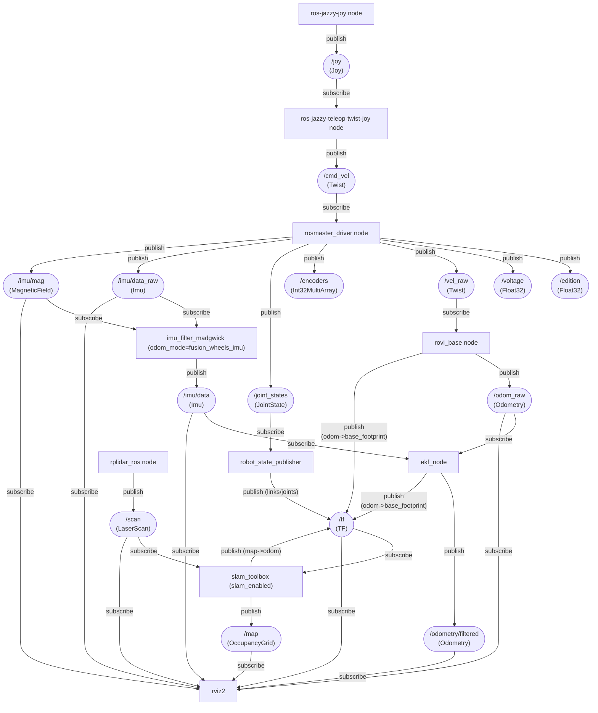

# rovi_ros_ws
ROS2 Jazzy workspace for Room View Bot

# Usage
For new environments, see [install](#install) first

clean build and run, notice venv activation after build and before launch :
```bash
source /opt/ros/jazzy/setup.bash
./clean.sh
colcon build
source install/setup.bash
source .venv/bin/activate
```

common launch examples :

|command | description |
|--------|-------------|
|ros2 launch rovi_bringup teleop.launch.py | joytick teleoperation of the robot|
|ros2 launch rovi_bringup mapping.launch.py | teleop + slam_toolbox mapping |
|ros2 launch rovi_bringup localization.launch.py map_file_name:=/path/to/map.posegraph | teleop + slam_toolbox localization on a saved pose-graph |
|ros2 launch rovi_bringup offline_view.launch.py | offline robot model visualization (URDF + joint_state_publisher_gui + RViz) |
|rviz2 -d install/share/rovi_description/rviz/rovi.rviz| visualization of the real robot (after sourcing ROS + install/setup.bash) |
|rviz2 -d install/share/rovi_description/rviz/rovi_map.rviz| visualization for SLAM (Fixed Frame: `map`, shows `/map`) |

# Install

* Install : https://docs.ros.org/en/jazzy/Installation/Ubuntu-Install-Debs.html

* Install uv (Python package and venv manager):

uv needed by the robot for control board python dependencies
```bash
curl -LsSf https://astral.sh/uv/install.sh | sh
```
* clone this repo and change to the `rovi_ros_ws` directory then run `uv sync`

* Install joystick and rplidar ros packages

```bash
# Teleop + mux
sudo apt install -y ros-jazzy-joy ros-jazzy-teleop-twist-joy ros-jazzy-twist-mux

# Diagnostics (rovi_base depends on it)
sudo apt install -y ros-jazzy-diagnostic-updater

# Viz + state publisher for offline visualization
sudo apt install -y ros-jazzy-robot-state-publisher ros-jazzy-joint-state-publisher-gui ros-jazzy-rviz2

# Lidar
sudo apt install -y ros-jazzy-rplidar-ros

# SLAM + localization
sudo apt install -y ros-jazzy-slam-toolbox ros-jazzy-robot-localization

# IMU orientation filter (used when odom_mode=fusion_wheels_imu)
sudo apt install -y ros-jazzy-imu-filter-madgwick
```

pixi on windows
```cmd
>pixi shell
>call C:\pixi_ws\ros2-windows\local_setup.bat
>colcon build --merge-install --base-paths rovi_ros_ws --packages-select rovi_description
call install\setup.bat
rviz2 -d install/share/rovi_description/rviz/rovi.rviz
```
# Description
## Packages
| Package | Role |
|---|---|
| `rovi_bringup` | Top-level launch entry points (teleop, visualization, mapping/localization stacks) |
| `rovi_description` | URDF + meshes + RViz configs; provides static TF like `base_footprint -> base_link -> laser_link` |
| `rosmaster_driver` | Hardware bridge: `/cmd_vel` → MCU, publishes `/vel_raw`, `/joint_states`, `/imu/data_raw`, `/imu/mag`, etc. |
| `rovi_base` | Odometry integrator: `/vel_raw` → `/odom_raw`; can publish TF `odom -> base_footprint` (raw odom) |
| `rovi_localization` | Odometry filtering pipeline: IMU orientation filter + EKF; publishes `/odometry/filtered` and TF `odom -> base_footprint` |
| `rovi_slam` | SLAM pipeline (`slam_toolbox`): publishes `/map` and TF `map -> odom` when enabled |

## Launches
| Package | Launch | Description |
|---|---|---|
| `rovi_bringup` | `teleop.launch.py` | Manual driving: joystick + teleop + base bringup (+ LiDAR if enabled) |
| `rovi_bringup` | `mapping.launch.py` | Teleoperation with SLAM mapping (`slam_toolbox`) |
| `rovi_bringup` | `offline_view.launch.py` | Offline Inspection of the robot model : URDF + joint_state_publisher_gui + RViz |
| `rovi_bringup` | `joy.launch.py` | Debug joystick → `/cmd_vel` only (no hardware required) |
| `rovi_bringup` | `localization.launch.py` | Bringup + SLAM localization on an existing map (`slam_toolbox` localization mode) |
| `rosmaster_driver` | `rosmaster_driver.launch.py` | Hardware driver only (serial/IMU/joints sanity checks) |
| `rovi_localization` | `ekf.launch.py` | Component launch: odometry pipeline (`odom_mode` selects raw/filtered/fusion_wheels_imu; useful without SLAM) |
| `rovi_slam` | `slam_toolbox.launch.py` | Component launch: `slam_toolbox` (mapping/localization selected by params) |

## Params
| Param | Package | Launch | Default | Explanation |
|---|---|---|---|---|
| `lidar_enabled` | `rovi_bringup` | `teleop.launch.py` | `true` | Starts LiDAR driver (`rplidar_ros`); without it there is no `/scan` |
| `slam_enabled` | `rovi_bringup` | `mapping.launch.py`, `localization.launch.py` | `true` | Starts `slam_toolbox`; publishes TF `map -> odom` (and `/map` in mapping mode) |
| `slam_enabled` | `rovi_slam` | `slam_toolbox.launch.py` | `true` | Starts `slam_toolbox`; publishes TF `map -> odom` (and `/map` in mapping mode) |
| `odom_mode` | `rovi_bringup` | `mapping.launch.py`, `localization.launch.py` | `fusion_wheels_imu` | Selects who publishes TF `odom -> base_footprint` (and whether IMU is used in that odom estimate) |
| `odom_mode` | `rovi_localization` | `ekf.launch.py` | `fusion_wheels_imu` | Same as above, but for running the odometry pipeline without SLAM |
| `mag_enabled` | `rovi_bringup` | `mapping.launch.py`, `localization.launch.py` | `false` | Enables magnetometer input for the IMU filter (used in `odom_mode=fusion_wheels_imu`; disabled by default due to interference risk) |
| `mag_enabled` | `rovi_localization` | `ekf.launch.py` | `false` | Enables magnetometer input for the IMU filter (used in `odom_mode=fusion_wheels_imu`; disabled by default due to interference risk) |

### Odometry Modes (`odom_mode`)
Used by: `rovi_bringup/mapping.launch.py`, `rovi_bringup/localization.launch.py`, and `rovi_localization/ekf.launch.py`.

| `odom_mode` | `rovi_base_publish_tf` (bringup) | TF `odom -> base_footprint` | Nodes started | Notes |
|---|---|---|---|---|
| `raw` | `true` | `rovi_base` | (none) | Fastest/simplest; wheel odom only (`/odom_raw`), no `/odometry/filtered` |
| `filtered` | `false` | `robot_localization/ekf_node` | `robot_localization/ekf_node` | Filters wheel odom (`/odom_raw` → `/odometry/filtered`) |
| `fusion_wheels_imu` | `false` | `robot_localization/ekf_node` | `imu_filter_madgwick` + `robot_localization/ekf_node` | Adds IMU yaw + yaw rate (`/imu/data_raw` → `/imu/data`); set `mag_enabled:=true` to use `/imu/mag` |


## Data Flow



## TF Tree (runtime)
TF frames are not regular ROS topics; this is the chain RViz and SLAM use at runtime.


## Odometry filtering (odom_mode=fusion_wheels_imu)
This produces a single authoritative `odom -> base_footprint` transform using EKF + IMU. For `odom_mode=filtered`, omit the IMU branch; magnetometer usage is gated by `mag_enabled`.


## SLAM (slam_toolbox)
This produces `map -> odom` so the robot pose is expressed in a stable map frame.


## Offline model
This launch from rovi_bringup helps to visualize the robot model without needing the actual robot hardware


## Launch wiring
`rovi_bringup` launches are composition layers: they include smaller "component" launches (teleop, odometry, SLAM). This keeps packages reusable (e.g., you can run SLAM against bag playback as long as `/scan` + TF exist).


## Package dependencies


# Nodes details
## rosmaster driver


| Movement | ros axis | rosmaster Axis |
|----------|----------|----------------|
| forward/backwards | X | -Y |
| left/right        | Y | X  |
| Rotation          | Z | Z  |

MPU Axis


- chip orientation : pin1 pointing to buzzer edge of rosmaster control board
- buzzer edge of rosmaster control board : is pointing to Robot Front Left corner

| Robot |IMU | ros axis |
|-----|------|----------|
| Right | X  | -Y |
| Front | Y  | X |
| Up    | Z  | Z |

Position | axis | value |
--------|-----|----|
|up facing up : | z | -9.8 |
|on left with right facing up : | x  | -9.8 |
|back with the front facing up | y | -9.8 |

## wheels

- `ROS-Driver-Board\1.Code\Factory STM32 firmware\Rosmaster_V3.5.1\ControlBoard_Rosmaster\Source\APP\app_mecanum.h`
- `ROS-Driver-Board\1.Code\Factory STM32 firmware\Rosmaster_V3.5.1\V3.5.1\Source\APP\app_motion.h`

```c++
#define MECANUM_MAX_CIRCLE_MM        (251.327f)

#define ENCODER_CIRCLE_205           (2464.0f)

typedef enum _car_type
{
    CAR_MECANUM_MAX = 0x02,//X3 PLUS
} car_type_t;
```
| Motor | wheel | direction |
|-------|-------|-----------|
|m1     | Front Left | flip |
|m2     | Front Right | |
|m3     | Back Left | |
|m4     | Back Right | flip |


| Robot Model        | Wheel Diameter (mm) | Wheel circumference (mm) | Wheel encoder steps |
|--------------------|---------------------|--------------------------|---------------------|
| X3                 | 80                  | 251.327                  | 2464                |


## Joystick
| Control           | Axis   | Axis sign | Robot action        | Robot command | command scale sign |
|-------------------|--------|-----------|---------------------|---------------|---------------|
| Left stick right  | axis 0  | +     | turn clockwise      | axis_angular.yaw | + |
| Left stick left   | axis 0  | -     | turn anti-clockwise | axis_angular.yaw | + |
| Right stick right | axis 3  | +     | move right          | axis_linear.y    | - |
| Right stick left  | axis 3  | -     | move left           | axis_linear.y    | - |
| Right stick down  | axis 4  | +     | move rear           | axis_linear.x    | - |
| Right stick up    | axis 4  | -     | move front          | axis_linear.x    | - |


Check your joystick before starting:
```bash
jstest /dev/input/js0
```

Check joystick → twist without touching the robot hardware:

```bash
ros2 launch rovi_bringup joy.launch.py \
  joy_dev:=0 \
  cmd_vel_topic:=/cmd_vel

ros2 topic echo /cmd_vel
```

- `joy_dev` is the SDL device index (0 ≈ `/dev/input/js0`).
- Override `joy_params_file` or `teleop_params_file` if you keep custom YAMLs elsewhere.


## ELP Stereo camera

```bash
v4l2-ctl --list-devices
v4l2-ctl -d /dev/video0 --list-formats-ext
```
see more details in [stereo camera](./docs/stereo.md)

## rplidar
where testing the rpilidar alone, it is necessary to add a transform for vosulazation

Steps :
- run the simple rplidar launch with

```bash
ros2 launch rplidar_ros rplidar.launch.py
```
- add a transform for visualization
```bash
ros2 run tf2_ros static_transform_publisher \
  0 0 0 0 0 0 \
  map laser
```
- then on windows open rviz
```cmd
>ros2 run rviz2 rviz2
```
- select default `map` on `Global Options/Fixed Frame` add a LaserScan and configure its topic to `/scan`

## wifi adapter
* using AX1800 from BrosTrend model No.: AX4L
* linux install doc https://linux.brostrend.com/
