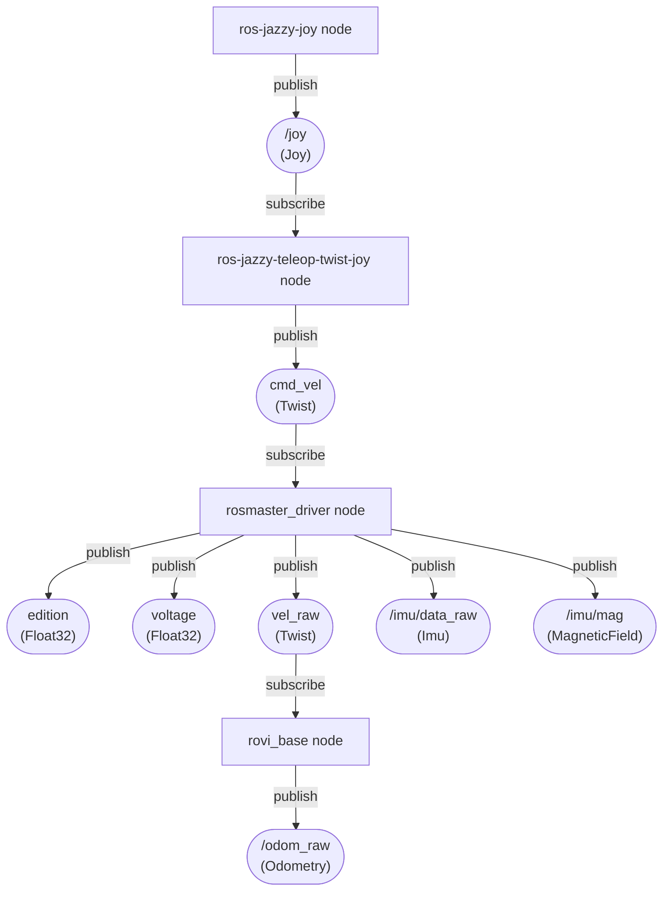

# rovi_ros_ws
ROS2 Jazzy workspace for Room View Bot

# Usage
clone this repo and change to the `rovi_ros_ws` directory then run `uv sync` at least once

clean build and run, notice venv activation after build and before launch :
```bash
source /opt/ros/jazzy/setup.bash
./clean.sh
colcon build
source install/setup.bash
source .venv/bin/activate
ros2 launch rovi_bringup teleop.launch.py
```

when the robot is running in headless mode, it is possible to see the topics output on a windows PC.

As a prerequisites make sure to troubleshout the connection with `ros2 multicast send` and `ros2 multicast receive`, e.g. wsl even with mirror mode might not work on some windows wifi adapters.

# Install
1) Install : https://docs.ros.org/en/jazzy/Installation/Ubuntu-Install-Debs.html

2) Install uv (Python package and venv manager):

```bash
curl -LsSf https://astral.sh/uv/install.sh | sh
```

3) Install joystick and rplidar ros packages

```bash
# Teleop + mux
sudo apt install -y ros-jazzy-joy ros-jazzy-teleop-twist-joy ros-jazzy-twist-mux

# Lidar: try apt first; if nothing, use Slamtec’s ROS 2 driver
sudo apt install -y ros-jazzy-rplidar-ros || true
```

# Data Flow



# Devices
## Joystick
| Control           | Axis   | Axis sign | Robot action        | Robot command | command scale sign |
|-------------------|--------|-----------|---------------------|---------------|---------------|
| Left stick right  | axis 0  - | -     | turn clockwise      | axis_angular.yaw | + |
| Left stick left   | axis 0  + | +     | turn anti-clockwise | axis_angular.yaw | + |
| Right stick left  | axis 3  - | -     | move left           | axis_linear.x +  | + |
| Right stick right | axis 3  + | +     | move right          | axis_linear.x -  | + |
| Right stick down  | axis 4  + | +     | move rear           | axis_linear.y -  | - |
| Right stick up    | axis 4  - | -     | move front          | axis_linear.y +  | - |


Check your joystick before starting:
```bash
jstest /dev/input/js0
```

Check joystick → twist without touching the robot hardware:

```bash
ros2 launch rovi_bringup joy.launch.py \
  joy_dev:=0 \
  cmd_vel_topic:=/cmd_vel

ros2 topic echo /cmd_vel
```

- `joy_dev` is the SDL device index (0 ≈ `/dev/input/js0`).
- Override `joy_params_file` or `teleop_params_file` if you keep custom YAMLs elsewhere.


## ELP Stereo camera

```bash
v4l2-ctl --list-devices
v4l2-ctl -d /dev/video0 --list-formats-ext
```
see more details in [stereo camera](./docs/stereo.md)

## rplidar
where testing the rpilidar alone, it is necessary to add a transform for vosulazation

Steps :
- run the simple rplidar launch with

```bash
ros2 launch rplidar_ros rplidar.launch.py
```
- add a transform for visualization
```bash
ros2 run tf2_ros static_transform_publisher \
  0 0 0 0 0 0 \
  map laser
```
- then on windows open rviz
```cmd
>pixi shell
>call C:\pixi_ws\ros2-windows\local_setup.bat
>ros2 run rviz2 rviz2
```
- select default `map` on `Global Options/Fixed Frame` add a LaserScan and configure its topic to `/scan`

