# Diagrams

## Unified Robot Interface
Command Interface and Feedback Interface are the contractual topics used by both the real robot and the simulation.

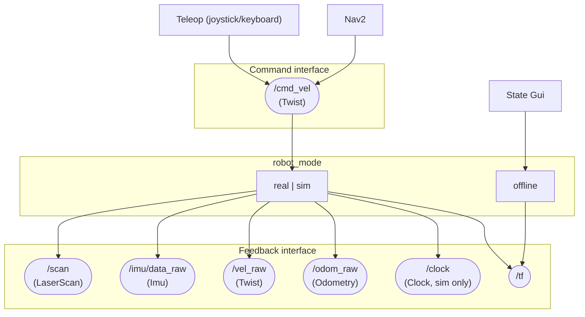

## UI bridge (gRPC)
`ros_ui_bridge` subscribes to ROS topics for robot state/telemetry and exposes them over gRPC (plus a few ROS viz helper topics). Topics shown match `src/ros_ui_bridge/config/default.yaml`.

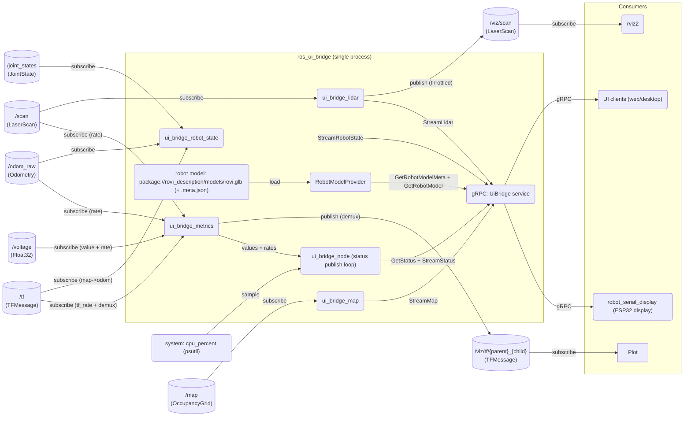

## Real robot
`robot_mode=real`

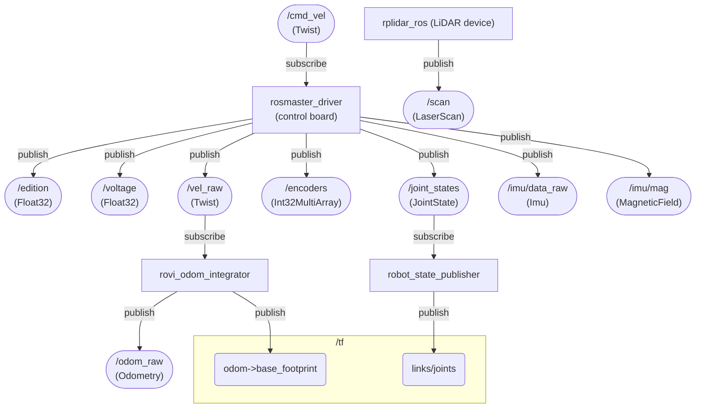

## Gazebo Simulation
`robot_mode=sim`

In this mode, the real robot is replaced by a Gazebo simulation while `rovi_localization` / `rovi_slam` / `rovi_nav` remain unchanged.

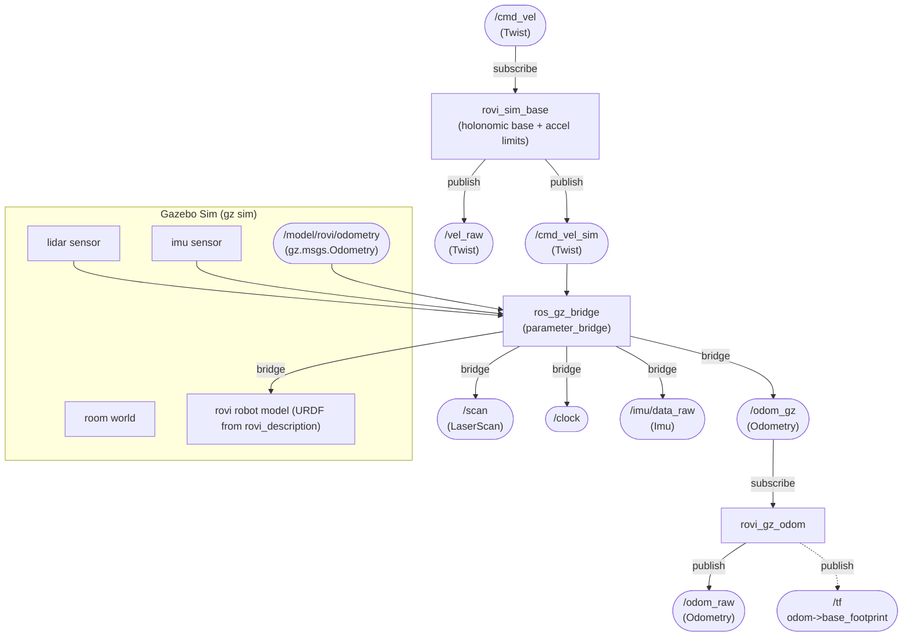

## Offline model
`robot_mode=offline`

This launch helps to visualize the robot to inspect its 3D model without other dependencies.

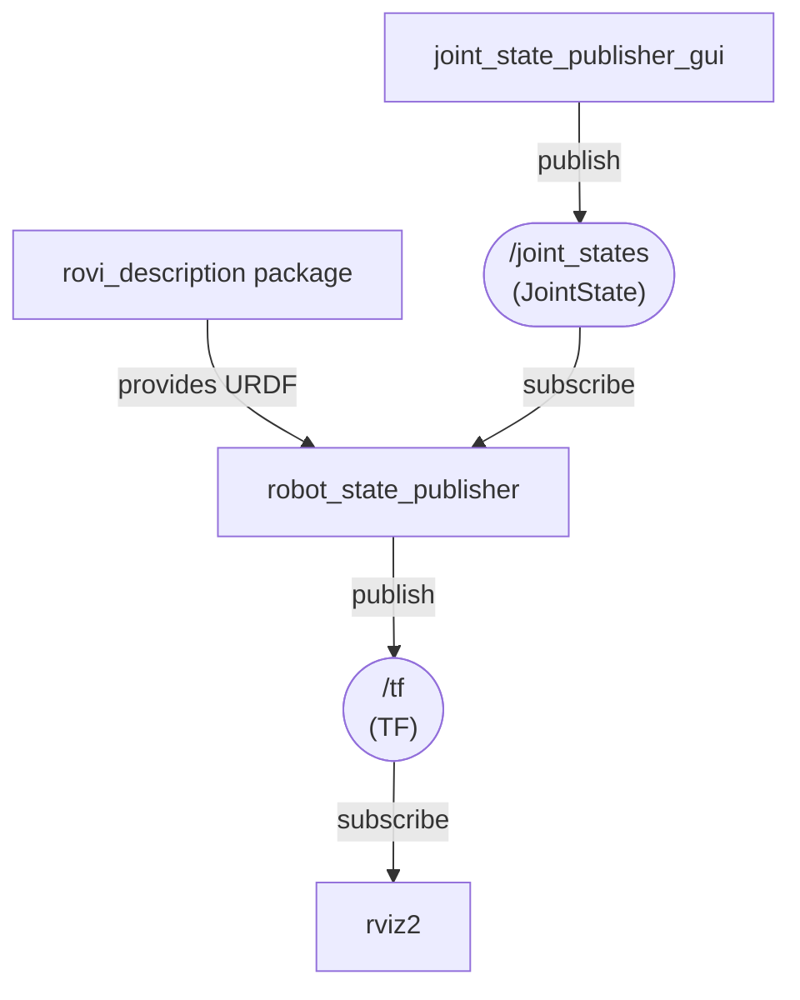

## Sim joint states
`robot_mode=sim`

In simulation we still publish `/joint_states` so `robot_state_publisher` (and any consumers like the UI bridge) can operate the same way as on the real robot.

We **do not** use upstream `joint_state_publisher` here because on ROS 2 Jazzy it can occasionally throw an `RCLError: context is not valid` during Ctrl-C shutdown (a shutdown race in `rclpy` executors). Instead we run a small local publisher.

## Robot Control

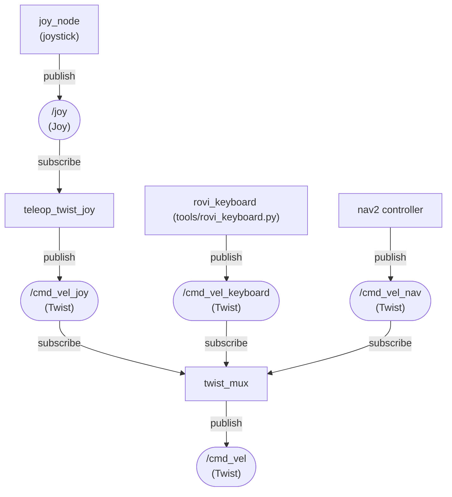

## Odometry filtering
Odometry filtering is only applicable for the real robot. When odom_mode=fusion_wheels_imu, this produces a single authoritative `odom -> base_footprint` transform using EKF + IMU. For `odom_mode=filtered`, omit the IMU branch; magnetometer usage is gated by `mag_enabled`.

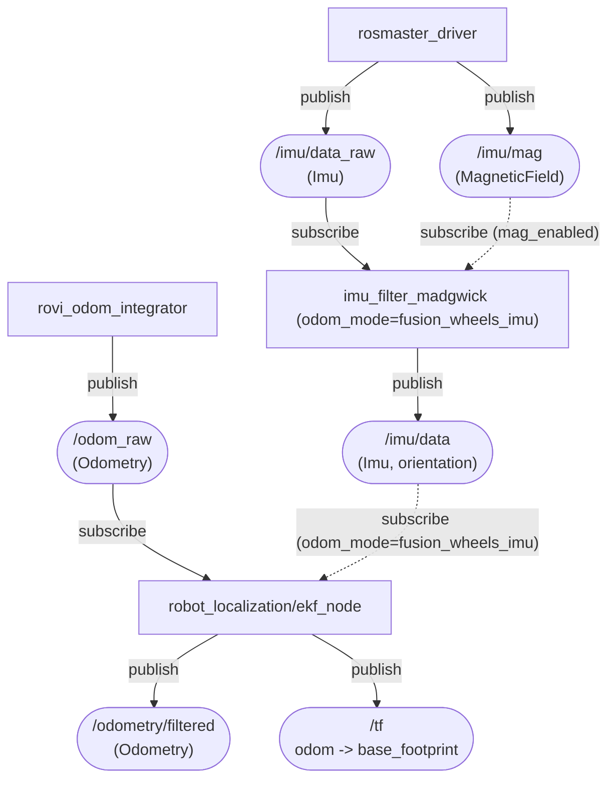

## SLAM
slam_toolbox produces `map -> odom` so the robot pose is expressed in a stable map frame. `slam_mode` selects `mapping` (build/update the map) or `localization` (load a saved pose-graph from `map_file_name`).

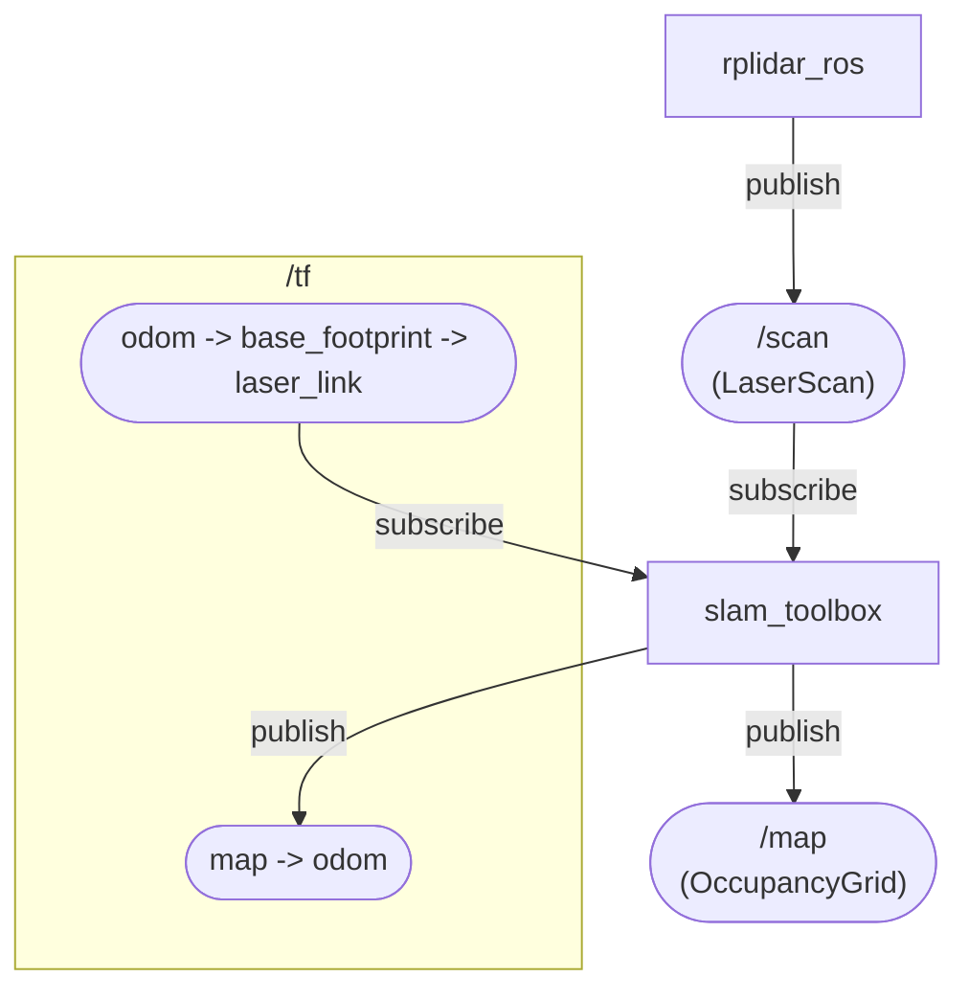

## Navigation
Nav2 consumes map + TF + sensors to compute `/cmd_vel` for the base.
For navigation, SLAM can run in `slam_mode=mapping` (default) or `slam_mode=localization` (requires `map_file_name`).

Lifecycle-managed nodes (configured/activated by `nav2_lifecycle_manager`): `nav2_bt_navigator/bt_navigator`, `nav2_planner/planner_server`, `nav2_controller/controller_server`, `nav2_behaviors/behavior_server`.

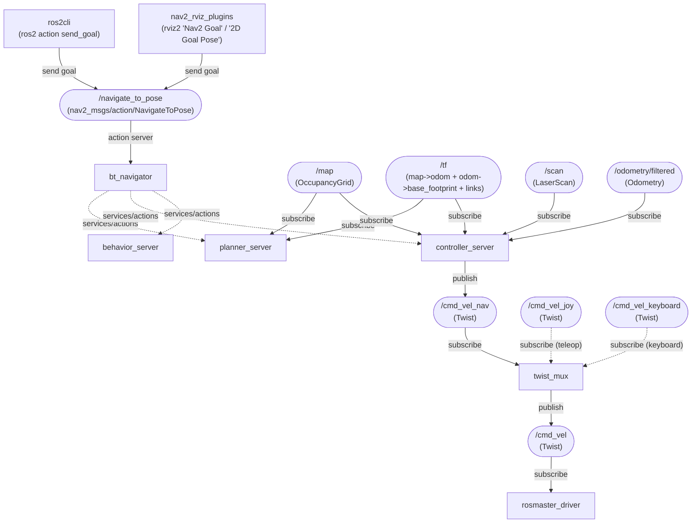

## Visualization

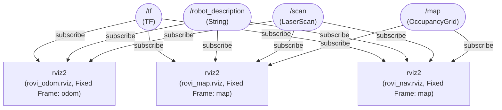

## TF Tree
TF frames are not regular ROS topics; this is the chain RViz and SLAM use at runtime.

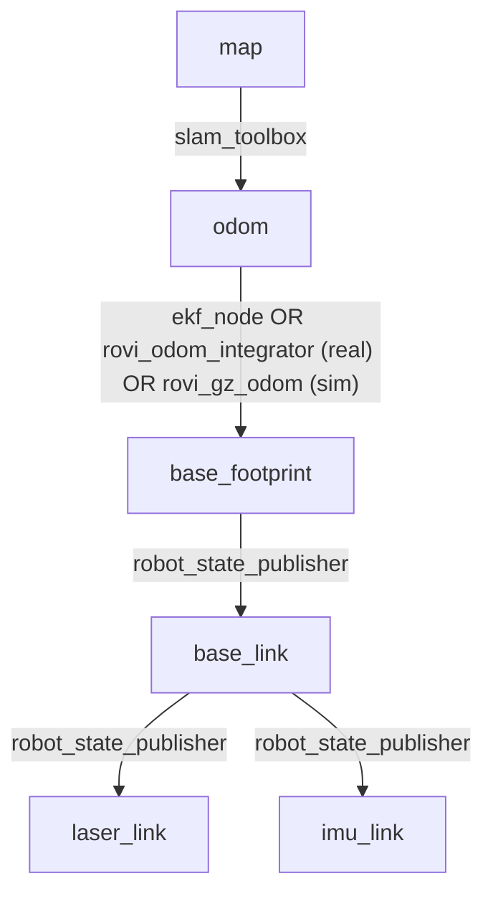

## Launch wiring
`rovi_bringup/robot_bringup.launch.py` selects the backend (`robot_mode:=real|sim|offline`), and `rovi_bringup/rovi.launch.py` is the single high-level entrypoint that chooses the stack and owns RViz startup policy.

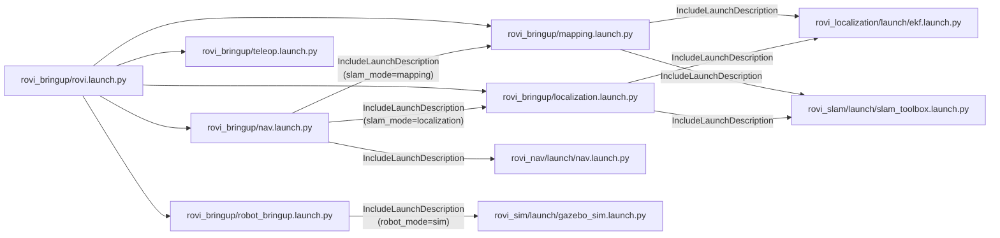

## Package dependencies
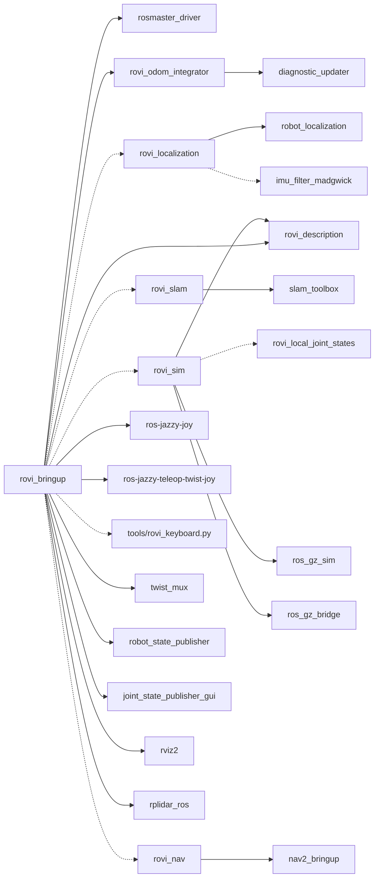
